# Exercise 1: Introduction and Setup

### Estimated Duration: 15 Minutes

## Scenario

In this exercise, you will use Visual Studio Code to work through the `src\01-introduction-setup.ipynb` notebook. You will install the required dependencies, connect to the Microsoft Foundry project, verify the connection to the deployed model, and confirm that the required environment variables and data files are available.

## Overview

This exercise follows the execution order of the notebook. You will run each code cell sequentially, review what it does, and validate its output before continuing to the next cell.

## Objectives

In this exercise, you will complete the following tasks:

- Task 1: Open and prepare the notebook in Visual Studio Code
- Task 2: Install the required dependencies
- Task 3: Connect to Microsoft Foundry
- Task 4: Validate the environment variables and data files

## Task 1: Open and prepare the notebook

In this task, you will open the introduction and setup notebook in Visual Studio Code and select the appropriate Python kernel.

1. In the **Lab VM**, open **Visual Studio Code** from the desktop.

   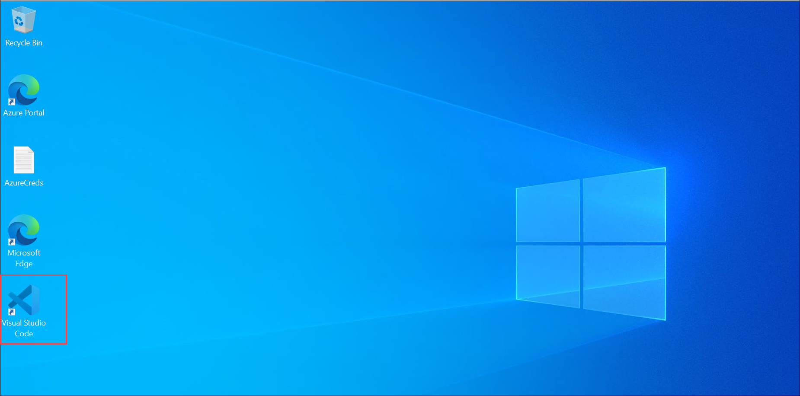

1. Click on **File (1)** and select **Open Folder... (2)**.

   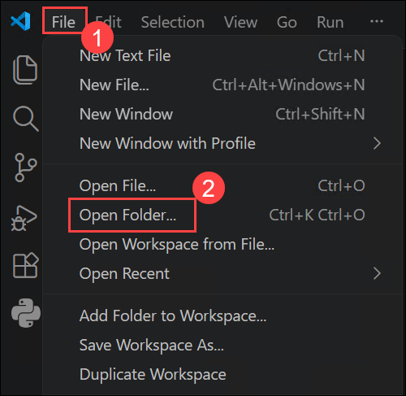

1. Navigate to `C:\LabFiles` **(1)**, select the **Build26-LAB521-improving-agent-behavior-using-reinforcement-learning-from-traces (2)** folder, and click **Select Folder (3)**.

   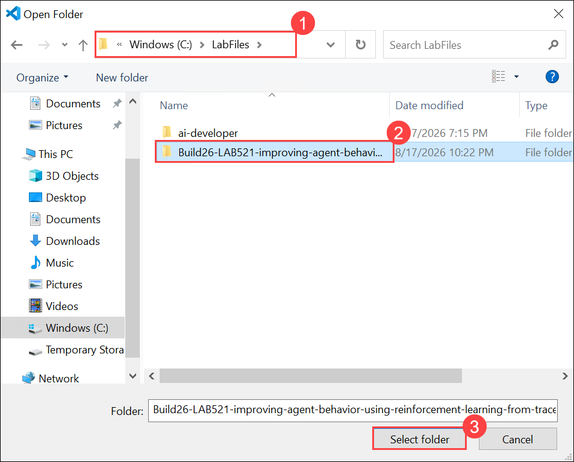

1. Click **Yes, I trust the authors** to trust the folder and enable all features.

   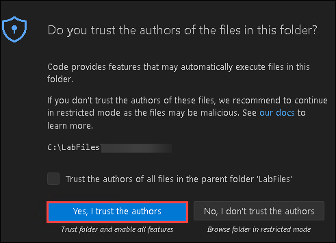

    >**Note:** If a pop-up window opens asking for Github Copilot chat wants to sign in, click on **Cancel**.

1. In VS Code, navigate to `src` folder and open **01-introduction-setup.ipynb** file.

   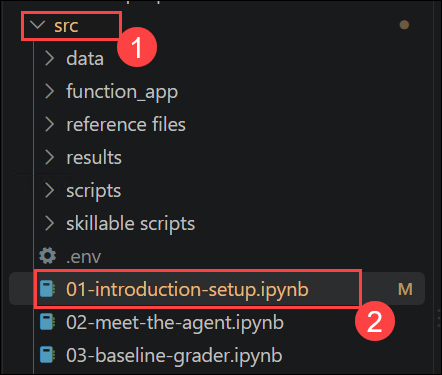
   

1. Select the Python environment configured for this lab.

    > **Note:** Run the notebook cells sequentially. Do not continue to the next cell if the current cell returns an error.

## Task 2: Install the required dependencies

In this task, you will install the Python packages required by the remaining notebooks.

1. Locate the first code cell in the notebook.

1. Run the following code:

    ```python
    # Install dependencies (uncomment if needed)
    %pip install -q openai python-dotenv requests tabulate matplotlib azure-ai-projects aiohttp
    ```

    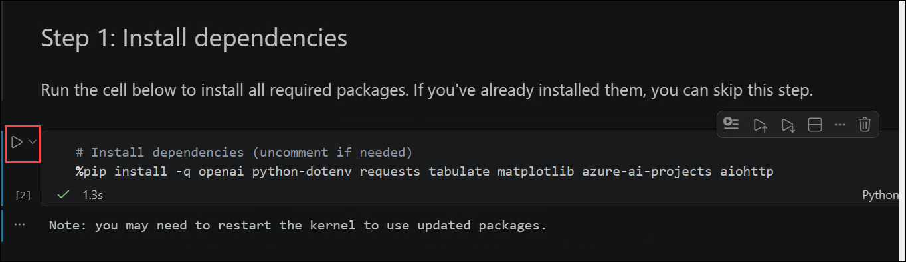

    **What this code does:**

    This code installs the Python dependencies required by the current notebook and the remaining lab exercises. These dependencies include packages for Microsoft Foundry, Azure authentication, OpenAI operations, environment-variable management, HTTP requests, data formatting, and visualization.

    **Before you run this cell:**

    - Confirm that the correct Python kernel is selected.
    - Confirm that the Lab VM has internet access.
    - If the packages are already installed, the command verifies that they are available in the selected environment.

    **Expected result/output:**

    The packages are installed successfully without errors. Because the `-q` option enables quiet mode, minimal output might be displayed.

1. If Visual Studio Code prompts you to restart the kernel after installing the packages, restart it before continuing.

   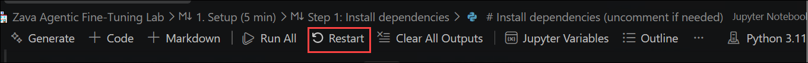

## Task 3: Connect to Microsoft Foundry

In this task, you will load the environment variables, authenticate to Azure, create the Microsoft Foundry project client, and test connectivity to the deployed model.

1. Locate the second code cell in the notebook.

1. Run the following code:

    ```python
    import json, os, re, time, textwrap
    import requests
    from dotenv import load_dotenv
    from azure.ai.projects import AIProjectClient
    from azure.identity import DefaultAzureCredential

    load_dotenv(override=True)

    project_client = AIProjectClient(
        endpoint=os.environ["FOUNDRY_PROJECT_ENDPOINT"],
        credential=DefaultAzureCredential()
    )
    client = project_client.get_openai_client(
        api_key=os.environ["AZURE_OPENAI_API_KEY"]
    )

    # Quick connectivity check — make a simple chat completion
    test = client.chat.completions.create(
        model="gpt-5-mini",
        messages=[{"role": "user", "content": "Say 'hello' in one word."}],
    )
    print(f"✅ Connected! Model responded: {test.choices[0].message.content}")
    ```

    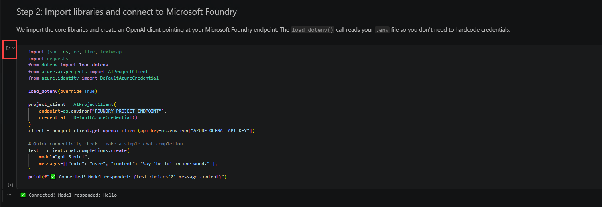

    **What this code does:**

    This code performs the following operations:

    - Imports the required Python modules.
    - Loads values from the `.env` file.
    - Uses `DefaultAzureCredential` to authenticate to Azure.
    - Creates a client for the Microsoft Foundry project.
    - Creates an OpenAI client using the configured API key.
    - Sends a simple prompt to the `gpt-5-mini` model to verify connectivity.

    **Before you run this cell:**

    - Run the dependency-installation cell successfully.
    - Confirm that the `.env` file contains the required values.
    - Confirm that the `gpt-5-mini` model is deployed and available to the project.
    - Complete any Azure authentication prompt that appears.

    **Expected result/output:**

    You should receive output similar to the following:

    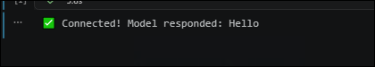

    > **Note:** The capitalization or punctuation in the model response might differ. The cell is successful if it displays the connection confirmation and returns a valid response.

## Task 4: Validate the environment variables and data files

In this task, you will verify that all required environment variables are configured and that the lab's data and result files are available.

1. Locate the third code cell in the notebook.

1. Run the following code:

    ```python
    # Verify environment variables
    required_vars = [
        "FOUNDRY_PROJECT_ENDPOINT",
        "AZURE_OPENAI_ENDPOINT",
        "AZURE_OPENAI_API_KEY"
    ]

    for var in required_vars:
        value = os.environ.get(var, "")
        if value:
            print(f"  ✅ {var} is set.")
        else:
            print(f"  ❌ {var} is NOT set! Check your .env file.")

    # Verify data files exist
    print("\nData files:")
    data_files = [
        "data/rft_v7_train.jsonl",
        "data/rft_v7_val.jsonl",
        "results/training_metrics.csv",
        "results/v7_checkpoint_eval.json"
    ]

    for f in data_files:
        exists = os.path.exists(f)
        size = os.path.getsize(f) if exists else 0
        status = f"✅ {size:,} bytes" if exists else "❌ MISSING"
        print(f"  {f}: {status}")

    print("\n🎉 Setup complete! Proceed to notebook 02-meet-the-agent.ipynb")
    ```

    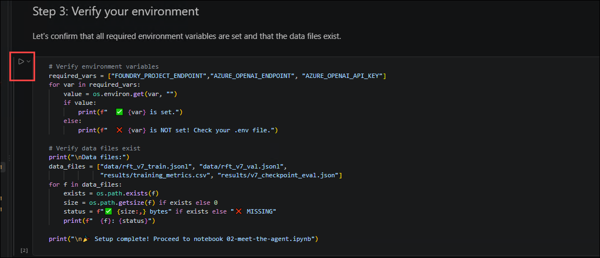

    **What this code does:**

    This code performs the following validation checks:

    - Confirms that the required environment variables are loaded.
    - Checks whether the required training, validation, metrics, and evaluation files exist.
    - Displays the size of each file when it is available.
    - Confirms when the setup is complete.

    **Before you run this cell:**

    - Run all previous cells successfully.
    - Confirm that the notebook is being run from the project's expected working directory.
    - Confirm that the `data` and `results` folders are available in the project.

    **Expected result/output:**

    You should receive output similar to the following:

    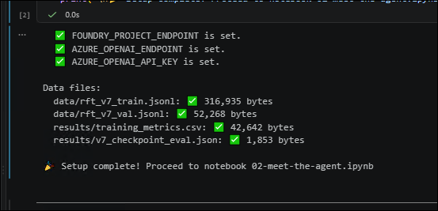

    > **Note:** The file sizes will vary depending on the files included with the lab.

1. Confirm that every environment variable displays a green check mark.

1. Confirm that none of the required files display `MISSING`.

1. If a file is reported as missing, verify that Visual Studio Code opened the correct project folder and that the notebook is running from the expected working directory.

## Summary

In this exercise, you have completed the following:

- Opened the introduction and setup notebook in Visual Studio Code.
- Selected the correct Python kernel.
- Installed the required Python dependencies.
- Connected to the Microsoft Foundry project.
- Tested the connection to the deployed `gpt-5-mini` model.
- Verified the required environment variables.
- Confirmed that the required data and result files are available.

### You have successfully completed this exercise. 
