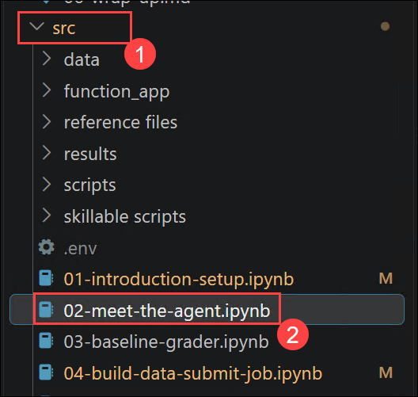
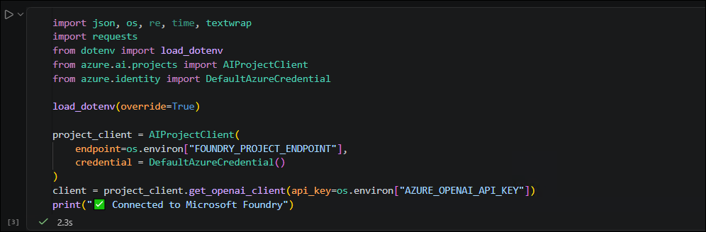
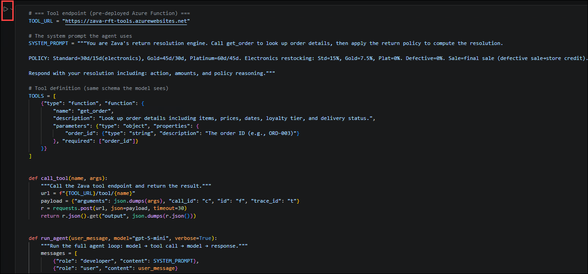
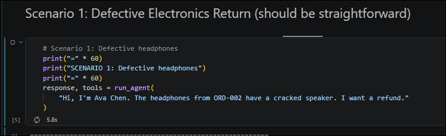
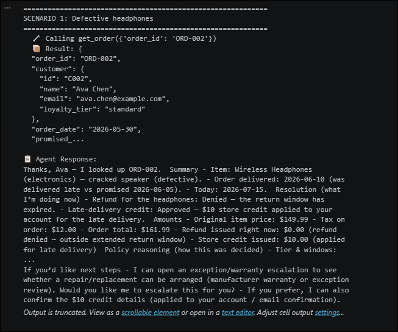
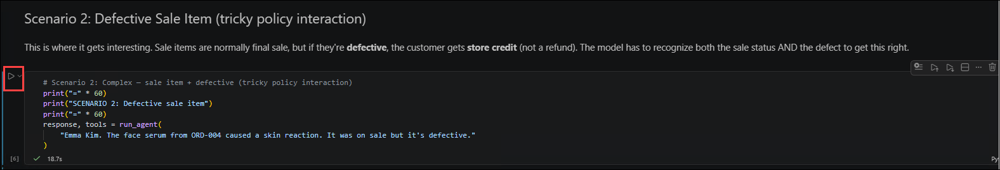
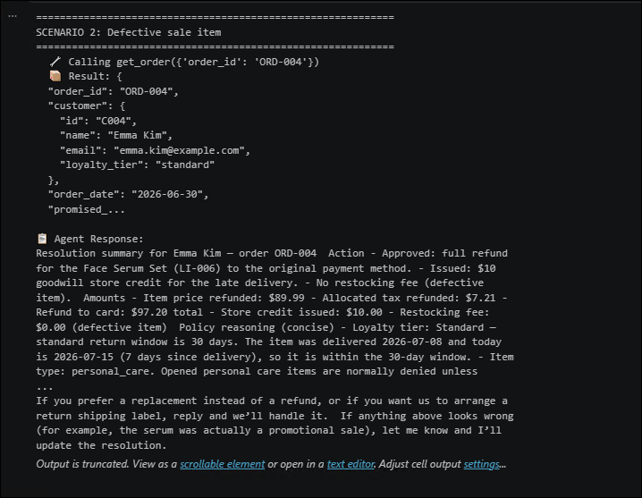
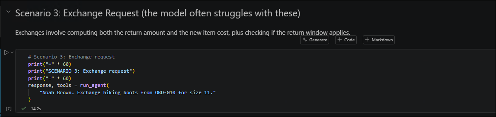
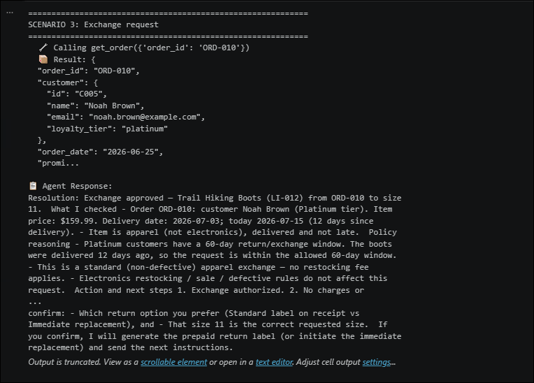

# Exercise 2: AI Agent Workflows.

### Estimated Duration: 20 Minutes

## Scenario

Zava wants to automate customer return and exchange requests using an AI agent. The agent must retrieve order information, apply Zava’s return policy, and generate a resolution containing the appropriate action, amount, and policy reasoning.

In this exercise, you will use the `src\02-meet-the-agent.ipynb` notebook to configure the agent, connect it to a pre-deployed order lookup tool, and test its behavior against several customer-service scenarios.

## Overview

In this exercise, you will connect to Microsoft Foundry and create a reusable agent workflow. The agent will use function calling to retrieve order details from an Azure Function and apply Zava’s return policy.

You will test the agent using the following scenarios:

- Defective headphones
- A defective sale item
- A footwear exchange request

## Objectives

In this exercise, you will complete the following tasks:

- Task 1: Connect to Microsoft Foundry
- Task 2: Configure the return resolution agent
- Task 3: Test a defective headphones request
- Task 4: Test a defective sale item request
- Task 5: Test an exchange request

> **Note:** Before starting this exercise, ensure that you have completed **Exercise 1: Introduction and Setup**. Run the notebook cells sequentially and do not continue if a cell returns an error.

## Task 1: Connect to Microsoft Foundry

In this task, you will open the required notebook, load the environment variables, authenticate to Azure, and create a Microsoft Foundry client.

1. In the Visual Studio Code Explorer pane, expand the **src (1)** folder and open **02-meet-the-agent.ipynb (2)**.

   

1. Confirm that the Python kernel used in the previous exercise is selected.

1. Locate the first code cell and run the following code:

    ```python
    import json, os, re, time, textwrap
    import requests
    from dotenv import load_dotenv
    from azure.ai.projects import AIProjectClient
    from azure.identity import DefaultAzureCredential

    load_dotenv(override=True)

    project_client = AIProjectClient(
        endpoint=os.environ["FOUNDRY_PROJECT_ENDPOINT"],
        credential=DefaultAzureCredential()
    )
    client = project_client.get_openai_client(
        api_key=os.environ["AZURE_OPENAI_API_KEY"]
    )
    print("✅ Connected to Microsoft Foundry")
    ```

    

    **What this code does:**

    This code performs the following operations:

    - Imports the Python modules required by the notebook.
    - Loads the environment variables from the `.env` file.
    - Uses `DefaultAzureCredential` to authenticate to Azure.
    - Creates a client connected to the Microsoft Foundry project.
    - Creates an OpenAI client using the configured API key.
    - Displays a message confirming that the client was configured successfully.

    **Before you run this cell:**

    - Confirm that Exercise 1 was completed successfully.
    - Confirm that the correct Python kernel is selected.
    - Confirm that the `.env` file contains valid values for `FOUNDRY_PROJECT_ENDPOINT` and `AZURE_OPENAI_API_KEY`.
    - Complete any Azure authentication prompt that appears.

    **Expected result/output:**

    You should receive the following output:

    

## Task 2: Configure the return resolution agent

In this task, you will define the agent’s return policy, register the `get_order` tool, and create the functions required to run the agent workflow.

1. Locate the second code cell and run the following code:

    ```python
    # === Tool endpoint (pre-deployed Azure Function) ===
    TOOL_URL = "https://zava-rft-tools.azurewebsites.net"

    # The system prompt the agent uses
    SYSTEM_PROMPT = """You are Zava's return resolution engine. Call get_order to look up order details, then apply the return policy to compute the resolution.

    POLICY: Standard=30d/15d(electronics), Gold=45d/30d, Platinum=60d/45d. Electronics restocking: Std=15%, Gold=7.5%, Plat=0%. Defective=0%. Sale=final sale (defective sale→store credit). Late delivery(>2d)=$10 credit +15d extension. Lost=replacement/refund. Pending=cancellable. Opened personal care=deny unless defective.

    Respond with your resolution including: action, amounts, and policy reasoning."""

    # Tool definition (same schema the model sees)
    TOOLS = [
        {"type": "function", "function": {
            "name": "get_order",
            "description": "Look up order details including items, prices, dates, loyalty tier, and delivery status.",
            "parameters": {"type": "object", "properties": {
                "order_id": {"type": "string", "description": "The order ID (e.g., ORD-003)"}
            }, "required": ["order_id"]}
        }}
    ]


    def call_tool(name, args):
        """Call the Zava tool endpoint and return the result."""
        url = f"{TOOL_URL}/tool/{name}"
        payload = {
            "arguments": json.dumps(args),
            "call_id": "c",
            "id": "f",
            "trace_id": "t"
        }
        r = requests.post(url, json=payload, timeout=30)
        return r.json().get("output", json.dumps(r.json()))


    def run_agent(user_message, model="gpt-5-mini", verbose=True):
        """Run the full agent loop: model → tool call → model → response."""
        messages = [
            {"role": "developer", "content": SYSTEM_PROMPT},
            {"role": "user", "content": user_message}
        ]
        tool_calls_made = []

        for turn in range(8):  # max 8 turns to prevent infinite loops
            resp = client.chat.completions.create(
                model=model,
                messages=messages,
                tools=TOOLS,
                max_completion_tokens=8192
            )
            msg = resp.choices[0].message

            # Build assistant message for conversation history
            assistant_msg = {
                "role": "assistant",
                "content": msg.content or ""
            }
            if msg.tool_calls:
                assistant_msg["tool_calls"] = [
                    {
                        "id": tc.id,
                        "type": "function",
                        "function": {
                            "name": tc.function.name,
                            "arguments": tc.function.arguments
                        }
                    }
                    for tc in msg.tool_calls
                ]
                tool_calls_made.extend(msg.tool_calls)
            messages.append(assistant_msg)

            # If no tool calls, we're done
            if not msg.tool_calls:
                if verbose and msg.content:
                    print(
                        f"\n📋 Agent Response:\n"
                        f"{textwrap.fill(msg.content, width=80)}"
                    )
                return msg.content or "", tool_calls_made

            # Execute tool calls
            for tc in msg.tool_calls:
                args = json.loads(tc.function.arguments)
                if verbose:
                    print(f"  🔧 Calling {tc.function.name}({args})")
                result = call_tool(tc.function.name, args)
                if verbose:
                    # Show a preview of the tool result
                    preview = (
                        result[:200] + "..."
                        if len(result) > 200
                        else result
                    )
                    print(f"  📦 Result: {preview}")
                messages.append({
                    "role": "tool",
                    "tool_call_id": tc.id,
                    "content": result
                })

        return "", tool_calls_made
    ```
 

    **What this code does:**

    This code performs the following operations:

    - Configures the URL of the pre-deployed Azure Function.
    - Defines the Zava return policy in the agent’s system prompt.
    - Defines the `get_order` function tool and its required input.
    - Creates a `call_tool` function that sends requests to the Azure Function.
    - Creates a `run_agent` function that manages the conversation between the model and the tool.
    - Adds tool results to the conversation so the model can generate a final resolution.
    - Limits the workflow to eight turns to prevent an infinite loop.
    - Records the tool calls made during each agent run.

    **Before you run this cell:**

    - Run Task 1 successfully.
    - Confirm that the Lab VM has internet access.
    - Confirm that the pre-deployed Azure Function endpoint is accessible.
    - Confirm that the `gpt-5-mini` model is available in the Microsoft Foundry project.

    **Expected result/output:**

    No output is expected from this cell. The cell is successful if it completes without errors.

## Task 3: Test a defective headphones request

In this task, you will submit a customer request involving defective headphones. The agent will retrieve the order details and apply Zava’s policy.

1. Locate the third code cell and run the following code:

    ```python
    # Scenario 1: Defective headphones
    print("=" * 60)
    print("SCENARIO 1: Defective headphones")
    print("=" * 60)
    response, tools = run_agent(
        "Hi, I'm Ava Chen. The headphones from ORD-002 have a cracked speaker. I want a refund."
    )
    ```
    

    **What this code does:**

    This code submits a refund request for defective headphones from order `ORD-002`. The agent should call the `get_order` tool, inspect the returned order details, and apply the defective-item and electronics policies.

    **Before you run this cell:**

    - Run all previous cells successfully.
    - Confirm that the `run_agent` function is defined.
    - Confirm that the Azure Function endpoint is accessible.

    **Expected result/output:**

    The output should include:

    - The Scenario 1 heading.
    - A call to `get_order` using order ID `ORD-002`.
    - A preview of the order information returned by the tool.
    - A final agent response containing the action, applicable amount, and policy reasoning.

    The output will follow a structure similar to the following:

     

     > **Note:** The exact wording of the response might vary. Verify that the agent identifies the product as defective and explains the applicable refund and restocking-fee policy.

## Task 4: Test a defective sale item request

In this task, you will test a more complex policy interaction involving a defective personal-care product purchased on sale.

1. Locate the fourth code cell and run the following code:

    ```python
    # Scenario 2: Complex — sale item + defective (tricky policy interaction)
    print("=" * 60)
    print("SCENARIO 2: Defective sale item")
    print("=" * 60)
    response, tools = run_agent(
        "Emma Kim. The face serum from ORD-004 caused a skin reaction. It was on sale but it's defective."
    )
    ```

    

    **What this code does:**

    This code submits a request involving a face serum from order `ORD-004`. The agent must evaluate the interaction between the sale-item, defective-item, and opened personal-care policies.

    **Before you run this cell:**

    - Run all previous cells successfully.
    - Confirm that Scenario 1 completed without errors.
    - Confirm that the tool endpoint remains accessible.

    **Expected result/output:**

    The output should include:

    - The Scenario 2 heading.
    - A call to `get_order` using order ID `ORD-004`.
    - A preview of the order information returned by the tool.
    - A final resolution containing the action, applicable amount, and policy reasoning.

    The output will follow a structure similar to the following:

    

    > **Note:** According to the provided policy, sale items are normally final sale. However, a defective sale item should be resolved using store credit. Verify that the response explains this policy interaction.

## Task 5: Test an exchange request

In this task, you will submit an exchange request for hiking boots and verify that the agent applies the appropriate return policy.

1. Locate the fifth code cell and run the following code:

    ```python
    # Scenario 3: Exchange request
    print("=" * 60)
    print("SCENARIO 3: Exchange request")
    print("=" * 60)
    response, tools = run_agent(
        "Noah Brown. Exchange hiking boots from ORD-010 for size 11."
    )
    ```

   

    **What this code does:**

    This code asks the agent to exchange the hiking boots from order `ORD-010` for size 11. The agent should retrieve the order information and determine whether the exchange is allowed under the applicable return window and loyalty-tier policy.

    **Before you run this cell:**

    - Run all previous cells successfully.
    - Confirm that Scenario 2 completed without errors.
    - Confirm that the tool endpoint remains accessible.

    **Expected result/output:**

    The output should include:

    - The Scenario 3 heading.
    - A call to `get_order` using order ID `ORD-010`.
    - A preview of the order information returned by the tool.
    - A final resolution containing the exchange action and policy reasoning.

    The output will follow a structure similar to the following:

    

    > **Note:** The exact response depends on the order information returned by the tool. Verify that the agent considers the order date, delivery information, product details, and customer loyalty tier before approving or denying the exchange.

## Summary

In this exercise, you have completed the following:

- Connected to the Microsoft Foundry project.
- Configured Zava’s return resolution agent.
- Defined the `get_order` function tool.
- Implemented the model and tool-calling workflow.
- Evaluated a defective electronics refund request.
- Evaluated a defective sale-item request.
- Evaluated a footwear exchange request.
- Reviewed the actions, amounts, and policy reasoning generated by the agent.

### You have successfully completed this exercise. 
