# Exercise 3: Evaluate Baseline Agent Performance

### Estimated Duration: 35 Minutes

## Scenario

Zava wants to measure the performance of its return resolution agent before improving it through reinforcement learning. To establish a reliable baseline, you will create a Python-based grader, load validation scenarios, generate or retrieve expected resolutions, evaluate the `gpt-5-mini` model, and calibrate an appropriate passing threshold.

## Overview

In this exercise, you will use the `src\03-baseline-grader.ipynb` notebook to evaluate the baseline agent. The grader will assess each response based on action correctness, monetary amount, policy reasoning, and use of the `get_order` tool.

The resulting metrics will help identify the agent’s current performance and establish a suitable pass threshold for later training and comparison.

## Objectives

In this exercise, you will complete the following tasks:

- Task 1: Connect to Microsoft Foundry
- Task 2: Configure the return resolution agent
- Task 3: Define the baseline grader
- Task 4: Load the validation scenarios
- Task 5: Load or generate ground-truth resolutions
- Task 6: Evaluate the baseline model
- Task 7: Calibrate the passing threshold

> **Note:** Before starting this exercise, ensure that you have completed **Exercise 2: Meet the Agent**. Run the notebook cells sequentially and do not continue if a cell returns an error.

## Task 1: Connect to Microsoft Foundry

In this task, you will open the baseline grader notebook, load the required environment variables, authenticate to Azure, and connect to the Microsoft Foundry project.

1. In VS Code, navigate to the `src` folder and open the **03-baseline-grader.ipynb** file.

   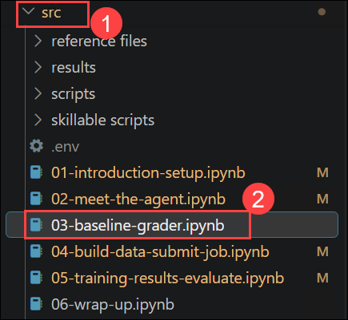

1. Confirm that the Python environment configured in the previous exercises is selected.

1. Locate the first code cell in the notebook.

1. Run the following code:

    ```python
    import json, os, re, time, textwrap
    import requests
    from dotenv import load_dotenv
    from azure.ai.projects import AIProjectClient
    from azure.identity import DefaultAzureCredential

    load_dotenv(override=True)

    project_client = AIProjectClient(
        endpoint=os.environ["FOUNDRY_PROJECT_ENDPOINT"],
        credential=DefaultAzureCredential()
    )
    client = project_client.get_openai_client(
        api_key=os.environ["AZURE_OPENAI_API_KEY"]
    )
    print("✅ Connected to Microsoft Foundry")
    ```

   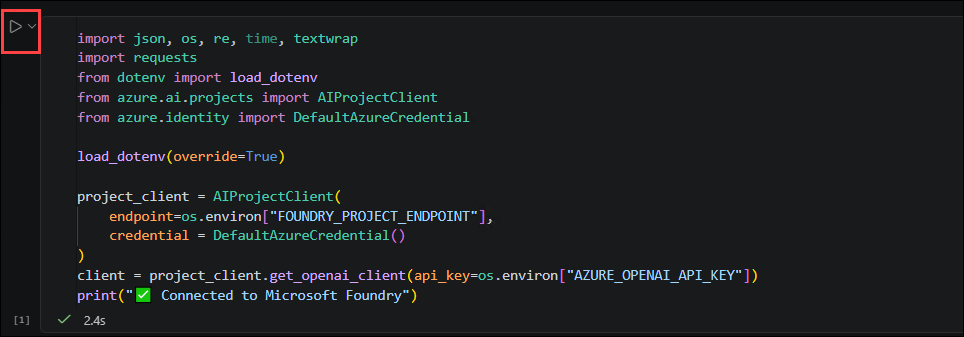

   **What this code does:**

   This code performs the following operations:

   - Imports the Python modules required by the notebook.
   - Loads environment variables from the `.env` file.
   - Uses `DefaultAzureCredential` to authenticate to Azure.
   - Creates a client for the Microsoft Foundry project.
   - Creates an OpenAI client using the configured API key.
   - Displays a message confirming the connection.

   **Before you run this cell:**

   - Confirm that the previous exercises were completed successfully.
   - Confirm that the correct Python kernel is selected.
   - Confirm that the `.env` file contains valid values for `FOUNDRY_PROJECT_ENDPOINT` and `AZURE_OPENAI_API_KEY`.
   - Complete any Azure authentication prompt that appears.

   **Expected result/output:**

   You should receive the following output:

   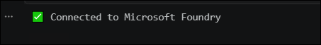

   > **Note:** If the connection fails, confirm that the environment variables are configured correctly and that your Azure credentials have access to the Microsoft Foundry project.

## Task 2: Configure the return resolution agent

In this task, you will define Zava’s return policy, configure the `get_order` tool, and create the functions required to run the agent.

1. Locate the second code cell in the notebook.

1. Run the following code:

    ```python
    # === Tool endpoint (pre-deployed Azure Function) ===
    TOOL_URL = "https://zava-rft-tools.azurewebsites.net"

    # The system prompt the agent uses
    SYSTEM_PROMPT = """You are Zava's return resolution engine. Call get_order to look up order details, then apply the return policy to compute the resolution.

    POLICY: Standard=30d/15d(electronics), Gold=45d/30d, Platinum=60d/45d. Electronics restocking: Std=15%, Gold=7.5%, Plat=0%. Defective=0%. Sale=final sale (defective sale→store credit). Late delivery(>2d)=$10 credit +15d extension. Lost=replacement/refund. Pending=cancellable. Opened personal care=deny unless defective.

    Respond with your resolution including: action, amounts, and policy reasoning."""

    # Tool definition (same schema the model sees)
    TOOLS = [
        {"type": "function", "function": {
            "name": "get_order",
            "description": "Look up order details including items, prices, dates, loyalty tier, and delivery status.",
            "parameters": {"type": "object", "properties": {
                "order_id": {"type": "string", "description": "The order ID (e.g., ORD-003)"}
            }, "required": ["order_id"]}
        }}
    ]


    def call_tool(name, args):
        """Call the Zava tool endpoint and return the result."""
        url = f"{TOOL_URL}/tool/{name}"
        payload = {
            "arguments": json.dumps(args),
            "call_id": "c",
            "id": "f",
            "trace_id": "t"
        }
        r = requests.post(url, json=payload, timeout=30)
        return r.json().get("output", json.dumps(r.json()))


    def run_agent(user_message, model="gpt-5-mini", verbose=True):
        """Run the full agent loop: model → tool call → model → response."""
        messages = [
            {"role": "developer", "content": SYSTEM_PROMPT},
            {"role": "user", "content": user_message}
        ]
        tool_calls_made = []

        for turn in range(8):  # max 8 turns to prevent infinite loops
            resp = client.chat.completions.create(
                model=model,
                messages=messages,
                tools=TOOLS,
                max_completion_tokens=8192
            )
            msg = resp.choices[0].message

            # Build assistant message for conversation history
            assistant_msg = {
                "role": "assistant",
                "content": msg.content or ""
            }
            if msg.tool_calls:
                assistant_msg["tool_calls"] = [
                    {
                        "id": tc.id,
                        "type": "function",
                        "function": {
                            "name": tc.function.name,
                            "arguments": tc.function.arguments
                        }
                    }
                    for tc in msg.tool_calls
                ]
                tool_calls_made.extend(msg.tool_calls)
            messages.append(assistant_msg)

            # If no tool calls, we're done
            if not msg.tool_calls:
                if verbose and msg.content:
                    print(
                        f"\n📋 Agent Response:\n"
                        f"{textwrap.fill(msg.content, width=80)}"
                    )
                return msg.content or "", tool_calls_made

            # Execute tool calls
            for tc in msg.tool_calls:
                args = json.loads(tc.function.arguments)
                if verbose:
                    print(f"  🔧 Calling {tc.function.name}({args})")
                result = call_tool(tc.function.name, args)
                if verbose:
                    # Show a preview of the tool result
                    preview = (
                        result[:200] + "..."
                        if len(result) > 200
                        else result
                    )
                    print(f"  📦 Result: {preview}")
                messages.append({
                    "role": "tool",
                    "tool_call_id": tc.id,
                    "content": result
                })

        return "", tool_calls_made
    ```

   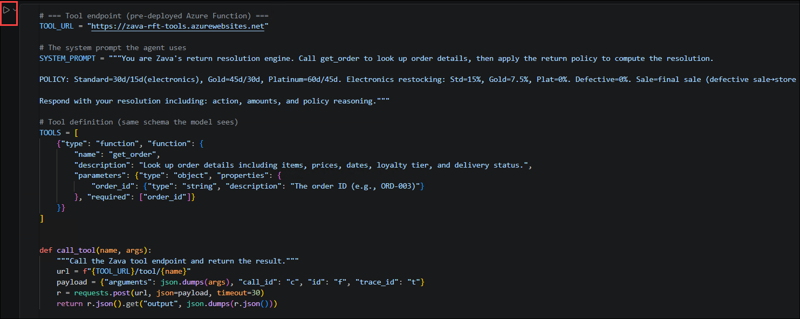

   **What this code does:**

   This code performs the following operations:

   - Configures the pre-deployed Azure Function endpoint.
   - Defines Zava’s return policy in the system prompt.
   - Defines the `get_order` function tool.
   - Creates a function that calls the Azure Function endpoint.
   - Creates the agent loop that exchanges messages between the model and the tool.
   - Records tool calls so they can be evaluated by the grader.
   - Limits the workflow to eight turns to prevent an infinite loop.

   **Before you run this cell:**

   - Run Task 1 successfully.
   - Confirm that the Lab VM has internet access.
   - Confirm that the Azure Function endpoint is accessible.
   - Confirm that the `gpt-5-mini` model is available in the project.

   **Expected result/output:**

   No output is expected. The cell is successful if it runs without errors.

## Task 3: Define the baseline grader

In this task, you will define a deterministic Python grader that compares an agent response with the expected resolution.

1. Locate the third code cell in the notebook.

1. Run the following code:

    ```python
    def python_grader(output_text, output_tools, expected_resolution):
        """Score a model response against the expected resolution.
        Returns 0.0 to 1.0 — same logic used during RFT training."""
        if not expected_resolution:
            return 0.5

        score = 0.0
        exp_lower = expected_resolution.lower()
        out_lower = (output_text or "").lower()

        # Action correctness (0.4)
        actions = {
            "refund": ["refund"],
            "denied": ["denied", "deny", "not eligible", "cannot", "expired"],
            "store credit": ["store credit", "store_credit"],
            "replacement": ["replacement", "replace"],
            "exchange": ["exchange", "swap"],
            "cancel": ["cancel", "cancellation"],
        }
        for action, keywords in actions.items():
            if any(k in exp_lower for k in keywords):
                if any(k in out_lower for k in keywords):
                    score += 0.4
                break

        # Amount correctness (0.3)
        exp_amounts = re.findall(r'\$(\d+\.\d{2})', expected_resolution)
        if exp_amounts:
            out_amounts = re.findall(r'\$(\d+\.\d{2})', output_text or "")
            hits = sum(1 for a in exp_amounts if a in out_amounts)
            score += 0.3 * (hits / len(exp_amounts))
        else:
            score += 0.15

        # Policy reasoning (0.2)
        policy_terms = [
            "window", "restocking", "defective", "sale", "platinum", "gold",
            "standard", "late", "shipping credit", "personal care", "eligible"
        ]
        exp_terms = [t for t in policy_terms if t in exp_lower]
        if exp_terms:
            hits = sum(1 for t in exp_terms if t in out_lower)
            score += 0.2 * (hits / len(exp_terms))

        # Tool usage bonus (0.1)
        if output_tools:
            tool_names = [
                t.function.name
                if hasattr(t, 'function')
                else t.get("function", {}).get("name", "")
                for t in output_tools
            ]
            if "get_order" in tool_names:
                score += 0.1

        return round(min(score, 1.0), 3)
    ```

   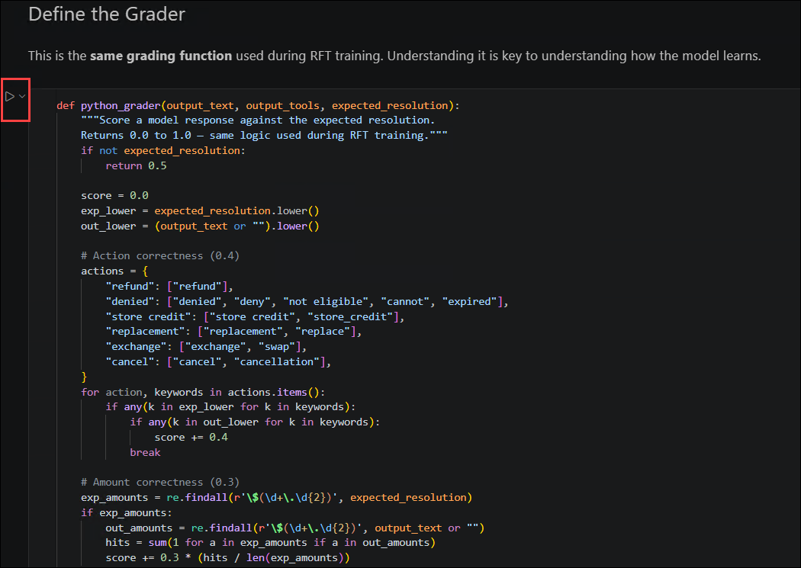

   **What this code does:**

   The `python_grader` function assigns a score from `0.0` to `1.0` using the following criteria:

   | Evaluation criterion | Weight |
   |---|---:|
   | Correct resolution action | 0.4 |
   | Correct monetary amount | 0.3 |
   | Relevant policy reasoning | 0.2 |
   | Correct use of `get_order` | 0.1 |

   The grader checks whether the response contains the expected action, monetary amounts, relevant policy terms, and the required tool call.

   **Before you run this cell:**

   - Run all previous cells successfully.
   - Confirm that the `re` module was imported in Task 1.

   **Expected result/output:**

   No output is expected. The cell is successful if it runs without errors and defines the `python_grader` function.

   > **Note:** If an expected resolution is unavailable, the function returns a default score of `0.5`.

## Task 4: Load the validation scenarios

In this task, you will load the validation dataset that will be used to evaluate the baseline model.

1. Locate the fourth code cell in the notebook.

1. Run the following code:

    ```python
    # Load validation scenarios
    with open("data/rft_v7_val.jsonl") as f:
        val_scenarios = [json.loads(line) for line in f]

    print(f"Loaded {len(val_scenarios)} validation scenarios")
    print(f"Sample: {val_scenarios[0]['messages'][-1]['content'][:80]}...")
    ```

   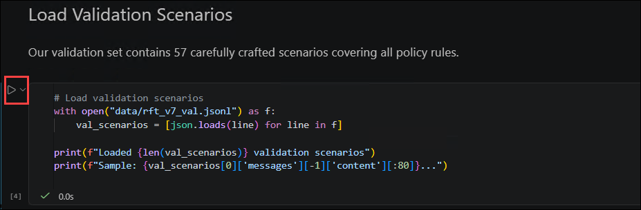

   **What this code does:**

   This code performs the following operations:

   - Opens the `data/rft_v7_val.jsonl` validation file.
   - Parses each JSON Lines record into a Python dictionary.
   - Stores the records in the `val_scenarios` list.
   - Displays the number of scenarios loaded.
   - Displays a preview of the first validation request.

   **Before you run this cell:**

   - Run all previous cells successfully.
   - Confirm that `data/rft_v7_val.jsonl` exists.
   - Confirm that the notebook is running from the project’s expected working directory.

   **Expected result/output:**

   You should receive output similar to the following:

   

   > **Note:** The number of scenarios and sample text depend on the contents of the validation dataset.

## Task 5: Load or generate ground-truth resolutions

In this task, you will load cached ground-truth resolutions when available. If the cache does not exist, the notebook will generate expected resolutions using the `gpt-5.4` model.

1. Locate the fifth code cell in the notebook.

1. Run the following code:

    ```python
    import os

    GT_FILE = "data/rft_v7_val_gt.jsonl"

    if os.path.exists(GT_FILE):
        with open(GT_FILE) as f:
            val_scenarios = [json.loads(line) for line in f]
        print(f"✅ Loaded {len(val_scenarios)} scenarios with cached ground truth")
        sample = val_scenarios[0].get("expected_resolution", "")[:120]
        print(f"   Sample resolution: {sample}...")
    else:
        print(f"Generating ground truth for {len(val_scenarios)} scenarios using gpt-5.4...")
        print("(~15–20 min — results cached to avoid re-running)\n")

        gt_scenarios = []
        for i, ex in enumerate(val_scenarios):
            msg = ex["messages"][-1]["content"]
            output, _ = run_agent(msg, model="gpt-5.4", verbose=False)
            ex_with_gt = dict(ex)
            ex_with_gt["expected_resolution"] = output
            gt_scenarios.append(ex_with_gt)
            print(f"  [{i+1:2d}/{len(val_scenarios)}] {msg[:70]}...")

        with open(GT_FILE, "w") as f:
            for ex in gt_scenarios:
                f.write(json.dumps(ex) + "\n")

        val_scenarios = gt_scenarios
        print(f"\n✅ Ground truth saved to {GT_FILE}")
        print(f"   Re-run this cell anytime to reload from cache")
    ```

   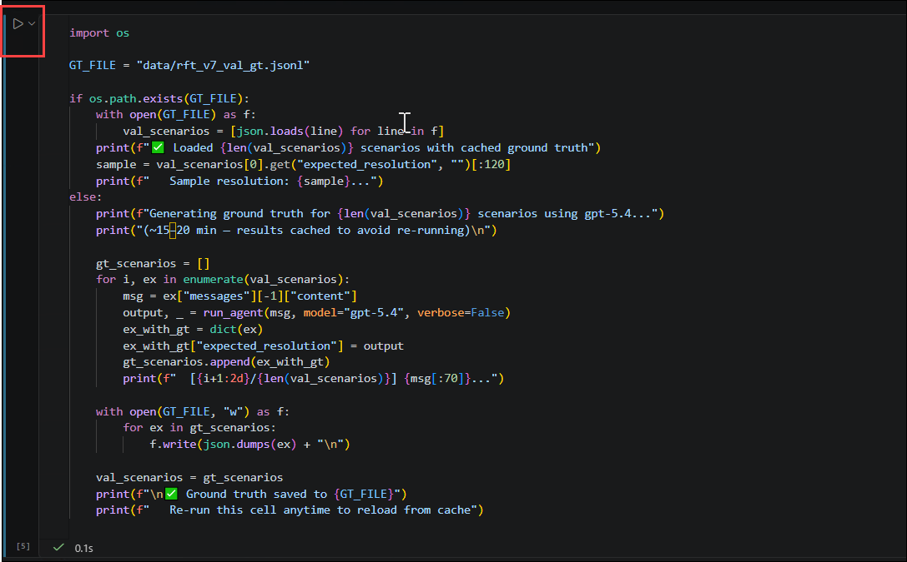

   **What this code does:**

   This code checks whether the cached ground-truth file exists:

   - If `data/rft_v7_val_gt.jsonl` exists, it loads the cached scenarios and expected resolutions.
   - If the file does not exist, it runs every validation request through `gpt-5.4`.
   - It adds the generated response as the `expected_resolution` for each scenario.
   - It saves the results so they can be reused without regenerating them.

   **Before you run this cell:**

   - Run all previous cells successfully.
   - Confirm that `gpt-5.4` is deployed and available in the Microsoft Foundry project.
   - Confirm that the Lab VM has internet access.
   - Allow approximately 15–20 minutes if the ground-truth cache must be generated.

   **Expected result/output:**

   If the cache exists, you should receive output similar to the following:

   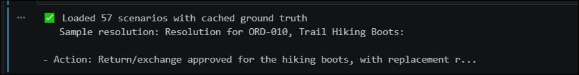

   > **Note:** Do not interrupt the notebook while ground-truth resolutions are being generated. Subsequent runs will load the cached file and complete much faster.

## Task 6: Evaluate the baseline model

In this task, you will select a reproducible sample of validation scenarios, run them through `gpt-5-mini`, and calculate baseline performance metrics.

1. Locate the sixth code cell in the notebook.

1. Run the following code:

    ```python
    # Run baseline evaluation (takes ~5-8 minutes with 30 scenarios)
    import random
    random.seed(42)
    eval_scenarios = random.sample(
        val_scenarios,
        min(8, len(val_scenarios))
    )

    print(f"Evaluating base gpt-5-mini on {len(eval_scenarios)} scenarios...\n")
    base_scores = []

    for i, ex in enumerate(eval_scenarios):
        msg = ex["messages"][-1]["content"]
        expected = ex.get("expected_resolution", "")

        output, tools = run_agent(
            msg,
            model="gpt-5-mini",
            verbose=False
        )
        score = python_grader(output, tools, expected)
        base_scores.append(score)

        status = "✅" if score >= 0.9 else ("⚠️" if score >= 0.5 else "❌")
        print(f"  [{i+1:2d}] {score:.3f} {status}  {msg[:55]}")

    base_avg = sum(base_scores) / len(base_scores)
    base_p90 = (
        sum(1 for s in base_scores if s >= 0.9)
        / len(base_scores)
    )
    base_p80 = (
        sum(1 for s in base_scores if s >= 0.8)
        / len(base_scores)
    )

    print(f"\n{'='*50}")
    print(f"  BASE gpt-5-mini RESULTS")
    print(f"  Average score: {base_avg:.1%}")
    print(f"  Pass@0.9 (strict): {base_p90:.0%}")
    print(f"  Pass@0.8 (good): {base_p80:.0%}")
    print(f"{'='*50}")
    ```

   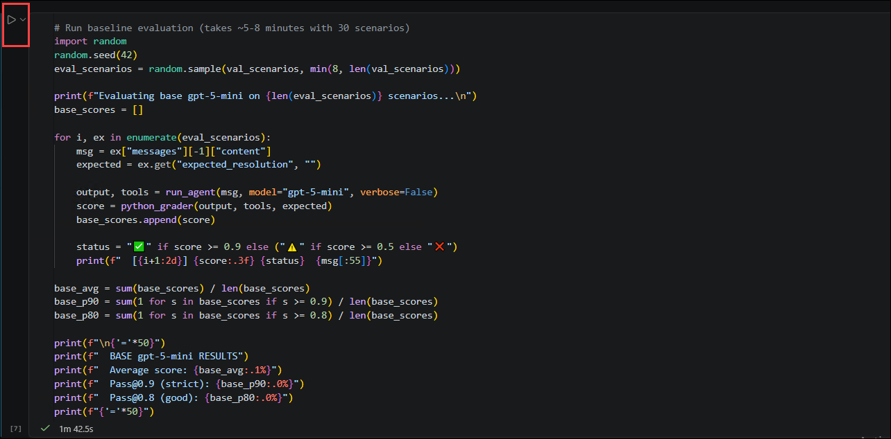

   **What this code does:**

   This code performs the following operations:

   - Sets a fixed random seed to make scenario selection reproducible.
   - Selects up to eight validation scenarios.
   - Runs each scenario through the baseline `gpt-5-mini` model.
   - Scores each response with the `python_grader` function.
   - Displays a status indicator for each score.
   - Calculates the average score.
   - Calculates the percentage of responses scoring at least `0.9`.
   - Calculates the percentage of responses scoring at least `0.8`.

   **Before you run this cell:**

   - Run all previous cells successfully.
   - Confirm that each scenario has an `expected_resolution`.
   - Confirm that the `gpt-5-mini` model is available.
   - Allow several minutes for the evaluation to complete.

   **Expected result/output:**

   Progress will be displayed for each scenario, followed by a summary similar to the following:

   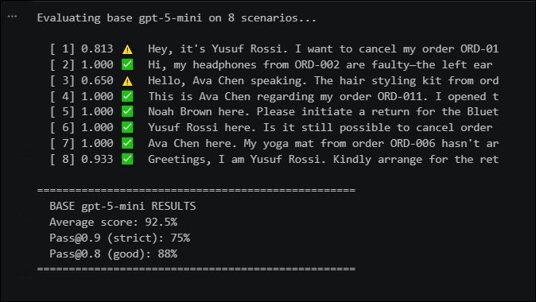

   > **Note:** Model responses can vary between runs. Therefore, your scores might differ slightly from the example output.

## Task 7: Calibrate the passing threshold

In this task, you will compare multiple score thresholds and select one that produces a useful failure rate for reinforcement learning.

1. Locate the seventh code cell in the notebook.

1. Run the following code:

    ```python
    # Calibration: what threshold gives the right failure rate?
    print("Pass threshold calibration (base gpt-5-mini):\n")
    print(
        f"  {'Threshold':>10} {'Pass Rate':>10} "
        f"{'Fail Rate':>10} {'Signal Quality':>15}"
    )
    print(
        f"  {'-'*10} {'-'*10} "
        f"{'-'*10} {'-'*15}"
    )

    for threshold in [0.5, 0.6, 0.7, 0.8, 0.85, 0.9, 0.95]:
        pass_rate = (
            sum(1 for s in base_scores if s >= threshold)
            / len(base_scores)
        )
        fail_rate = 1 - pass_rate
        quality = (
            "✅ Good (25-50%)"
            if 0.25 <= fail_rate <= 0.50
            else (
                "⚠️ Too easy"
                if fail_rate < 0.25
                else "⚠️ Too hard"
            )
        )
        print(
            f"  {threshold:>10.2f} {pass_rate:>9.0%} "
            f"{fail_rate:>9.0%} {quality:>15}"
        )

    print(
        "\n💡 From our experiments pass_threshold=0.80 gives "
        "on average 35% failure rate → good learning signal"
    )
    ```

   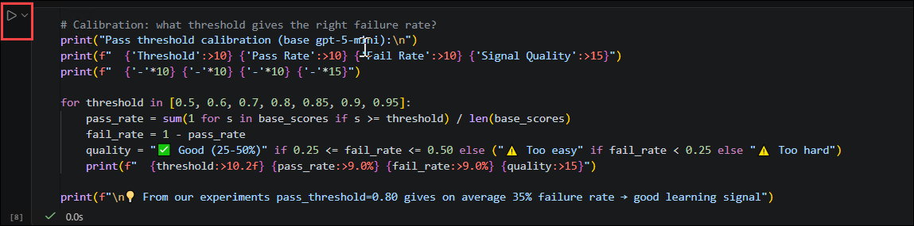

   **What this code does:**

   This code performs the following operations:

   - Tests passing thresholds ranging from `0.50` to `0.95`.
   - Calculates the pass and failure rates for each threshold.
   - Classifies the resulting learning signal as too easy, good, or too hard.
   - Identifies `0.80` as the recommended threshold based on prior experiments.

   **Before you run this cell:**

   - Complete the baseline evaluation successfully.
   - Confirm that the `base_scores` list contains the evaluation scores.

   **Expected result/output:**

   You should receive a calibration table similar to the following:

   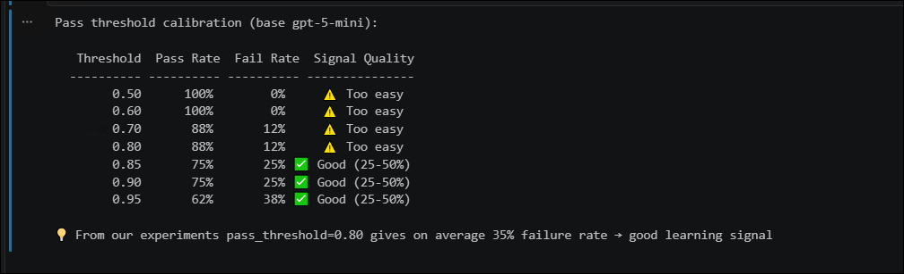

   > **Note:** The observed failure rate can vary because model responses are nondeterministic. Use the displayed table to confirm whether `0.80` provides a useful learning signal for the current run.

## Summary

In this exercise, you have completed the following:

- Opened the `03-baseline-grader.ipynb` notebook.
- Connected to the Microsoft Foundry project.
- Configured Zava’s return resolution agent and order lookup tool.
- Created a deterministic Python grader.
- Loaded the validation scenarios.
- Loaded or generated ground-truth resolutions.
- Evaluated the baseline `gpt-5-mini` model.
- Calculated average and pass-rate metrics.
- Calibrated the passing threshold for later reinforcement learning.
- Established `0.80` as the recommended baseline passing threshold.

### You have successfully completed this exercise.
