# Exercise 4: Build Training Data and Submit a Reinforcement Fine-Tuning Job

### Estimated Duration: 40 Minutes

## Scenario

Zava wants to improve the performance of its return resolution agent using reinforcement fine-tuning. Before training can begin, the development team must inspect the training and validation datasets, verify the grading logic, upload the datasets, configure the reinforcement grader, and submit a fine-tuning job to Microsoft Foundry.

## Overview

In this exercise, you will use the `src\04-build-data-submit-job.ipynb` notebook to prepare and submit a reinforcement fine-tuning job. You will inspect the training data, test a custom scenario, upload the training and validation files, embed the Python grader, and configure the job’s tools and hyperparameters.

## Objectives

In this exercise, you will complete the following tasks:

- Task 1: Connect to Microsoft Foundry
- Task 2: Configure the direct Azure OpenAI client
- Task 3: Configure the agent and grader
- Task 4: Inspect the training example format
- Task 5: Review the training and validation datasets
- Task 6: Inspect sample order data
- Task 7: Test a custom training example
- Task 8: Upload the training and validation files
- Task 9: Define the reinforcement grader
- Task 10: Submit the reinforcement fine-tuning job

> **Note:** Before starting this exercise, ensure that you have completed **Exercise 3: Evaluate Baseline Agent Performance**. Run the notebook cells sequentially and do not continue if a cell returns an error.

> **Important:** Submitting a fine-tuning job can incur Azure usage charges. The training job can take up to 10 hours to complete.

## Task 1: Connect to Microsoft Foundry

In this task, you will open the notebook, load the required environment variables, authenticate to Azure, and connect to the Microsoft Foundry project.

1. In VS Code, navigate to the `src` **(1)** folder and open the **04-build-data-submit-job.ipynb (2)** file.

   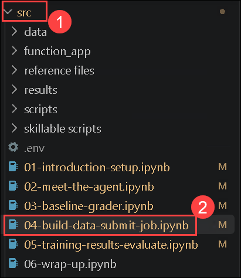

1. Confirm that the Python environment configured in the previous exercises is selected.

1. Locate the first code cell in the notebook.

1. Run the following code:

    ```python
    import json, os, re, time, textwrap
    import requests
    from dotenv import load_dotenv
    from azure.ai.projects import AIProjectClient
    from azure.identity import DefaultAzureCredential

    load_dotenv(override=True)

    project_client = AIProjectClient(
        endpoint=os.environ["FOUNDRY_PROJECT_ENDPOINT"],
        credential=DefaultAzureCredential()
    )
    client = project_client.get_openai_client(
        api_key=os.environ["AZURE_OPENAI_API_KEY"]
    )
    print("✅ Connected to Microsoft Foundry")
    ```

   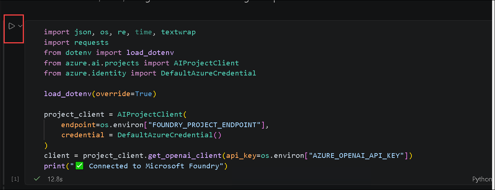

   **What this code does:**

   This code performs the following operations:

   - Imports the Python modules required by the notebook.
   - Loads environment variables from the `.env` file.
   - Uses `DefaultAzureCredential` to authenticate to Azure.
   - Creates a client for the Microsoft Foundry project.
   - Creates an OpenAI client using the configured API key.
   - Displays a message confirming the connection.

   **Before you run this cell:**

   - Confirm that the previous exercises were completed successfully.
   - Confirm that the correct Python kernel is selected.
   - Confirm that the `.env` file contains valid values for `FOUNDRY_PROJECT_ENDPOINT` and `AZURE_OPENAI_API_KEY`.
   - Complete any Azure authentication prompt that appears.

   **Expected result/output:**

   You should receive the following output:

   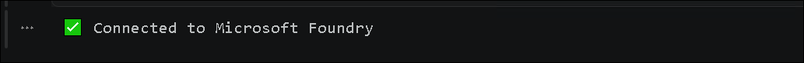

   > **Note:** If the connection fails, verify the environment-variable values and confirm that your Azure credentials have access to the Microsoft Foundry project.

## Task 2: Configure the direct Azure OpenAI client

In this task, you will replace the project-based OpenAI client with a client that connects directly to the Azure OpenAI endpoint.

1. Locate the second code cell in the notebook.

1. Run the following code:

    ```python
    # Workaround: use direct Azure OpenAI endpoint client to avoid project-identity RBAC path.
    from openai import OpenAI

    client = OpenAI(
        api_key=os.environ["AZURE_OPENAI_API_KEY"],
        base_url=os.environ["AZURE_OPENAI_ENDPOINT"]
    )
    print("✅ Switched to direct Azure OpenAI client")
    ```

   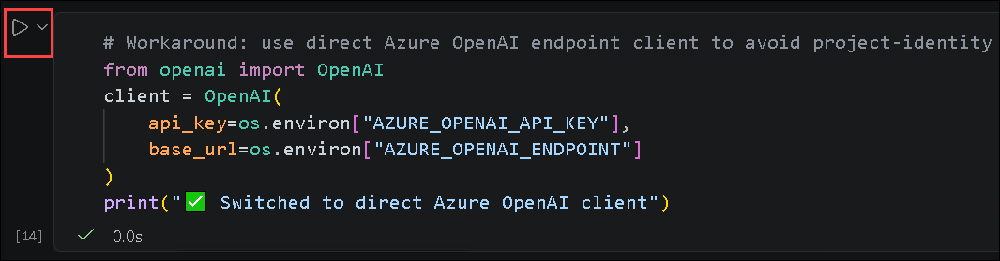

   **What this code does:**

   This code performs the following operations:

   - Imports the `OpenAI` client.
   - Creates a client that connects directly to the configured Azure OpenAI endpoint.
   - Uses the Azure OpenAI API key for authentication.
   - Avoids the project-identity RBAC path for subsequent file and fine-tuning operations.

   **Before you run this cell:**

   - Run Task 1 successfully.
   - Confirm that `AZURE_OPENAI_ENDPOINT` and `AZURE_OPENAI_API_KEY` are configured in the `.env` file.
   - Confirm that the endpoint supports the required file upload and fine-tuning operations.

   **Expected result/output:**

   You should receive the following output:

   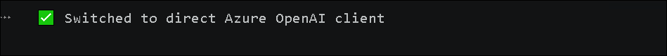

## Task 3: Configure the agent and grader

In this task, you will configure Zava’s return resolution agent, define the `get_order` tool, and create the Python grading function used to evaluate responses.

1. Locate the third code cell in the notebook.

1. Run the following code:

    ```python
    # === Tool endpoint (pre-deployed Azure Function) ===
    TOOL_URL = "https://zava-rft-tools.azurewebsites.net"

    # The system prompt the agent uses
    SYSTEM_PROMPT = """You are Zava's return resolution engine. Call get_order to look up order details, then apply the return policy to compute the resolution.

    POLICY: Standard=30d/15d(electronics), Gold=45d/30d, Platinum=60d/45d. Electronics restocking: Std=15%, Gold=7.5%, Plat=0%. Defective=0%. Sale=final sale (defective sale→store credit). Late delivery(>2d)=$10 credit +15d extension. Lost=replacement/refund. Pending=cancellable. Opened personal care=deny unless defective.

    Respond with your resolution including: action, amounts, and policy reasoning."""

    # Tool definition (same schema the model sees)
    TOOLS = [
        {"type": "function", "function": {
            "name": "get_order",
            "description": "Look up order details including items, prices, dates, loyalty tier, and delivery status.",
            "parameters": {"type": "object", "properties": {
                "order_id": {
                    "type": "string",
                    "description": "The order ID (e.g., ORD-003)"
                }
            }, "required": ["order_id"]}
        }}
    ]


    def call_tool(name, args):
        """Call the Zava tool endpoint and return the result."""
        url = f"{TOOL_URL}/tool/{name}"
        payload = {
            "arguments": json.dumps(args),
            "call_id": "c",
            "id": "f",
            "trace_id": "t"
        }
        r = requests.post(url, json=payload, timeout=30)
        return r.json().get("output", json.dumps(r.json()))


    def run_agent(user_message, model="gpt-5-mini", verbose=True):
        """Run the full agent loop: model → tool call → model → response."""
        messages = [
            {"role": "developer", "content": SYSTEM_PROMPT},
            {"role": "user", "content": user_message}
        ]
        tool_calls_made = []

        for turn in range(8):  # max 8 turns to prevent infinite loops
            resp = client.chat.completions.create(
                model=model,
                messages=messages,
                tools=TOOLS,
                max_completion_tokens=8192
            )
            msg = resp.choices[0].message

            # Build assistant message for conversation history
            assistant_msg = {
                "role": "assistant",
                "content": msg.content or ""
            }
            if msg.tool_calls:
                assistant_msg["tool_calls"] = [
                    {
                        "id": tc.id,
                        "type": "function",
                        "function": {
                            "name": tc.function.name,
                            "arguments": tc.function.arguments
                        }
                    }
                    for tc in msg.tool_calls
                ]
                tool_calls_made.extend(msg.tool_calls)
            messages.append(assistant_msg)

            # If no tool calls, we're done
            if not msg.tool_calls:
                if verbose and msg.content:
                    print(
                        f"\n📋 Agent Response:\n"
                        f"{textwrap.fill(msg.content, width=80)}"
                    )
                return msg.content or "", tool_calls_made

            # Execute tool calls
            for tc in msg.tool_calls:
                args = json.loads(tc.function.arguments)
                if verbose:
                    print(f"  🔧 Calling {tc.function.name}({args})")
                result = call_tool(tc.function.name, args)
                if verbose:
                    # Show a preview of the tool result
                    preview = (
                        result[:200] + "..."
                        if len(result) > 200
                        else result
                    )
                    print(f"  📦 Result: {preview}")
                messages.append({
                    "role": "tool",
                    "tool_call_id": tc.id,
                    "content": result
                })

        return "", tool_calls_made


    def python_grader(output_text, output_tools, expected_resolution):
        """Score a model response against the expected resolution.
        Returns 0.0 to 1.0 — same logic used during RFT training."""
        if not expected_resolution:
            return 0.5

        score = 0.0
        exp_lower = expected_resolution.lower()
        out_lower = (output_text or "").lower()

        # Action correctness (0.4)
        actions = {
            "refund": ["refund"],
            "denied": [
                "denied", "deny", "not eligible", "cannot", "expired"
            ],
            "store credit": ["store credit", "store_credit"],
            "replacement": ["replacement", "replace"],
            "exchange": ["exchange", "swap"],
            "cancel": ["cancel", "cancellation"],
        }
        for action, keywords in actions.items():
            if any(k in exp_lower for k in keywords):
                if any(k in out_lower for k in keywords):
                    score += 0.4
                break

        # Amount correctness (0.3)
        exp_amounts = re.findall(r'\$(\d+\.\d{2})', expected_resolution)
        if exp_amounts:
            out_amounts = re.findall(
                r'\$(\d+\.\d{2})',
                output_text or ""
            )
            hits = sum(1 for a in exp_amounts if a in out_amounts)
            score += 0.3 * (hits / len(exp_amounts))
        else:
            score += 0.15

        # Policy reasoning (0.2)
        policy_terms = [
            "window", "restocking", "defective", "sale", "platinum",
            "gold", "standard", "late", "shipping credit",
            "personal care", "eligible"
        ]
        exp_terms = [t for t in policy_terms if t in exp_lower]
        if exp_terms:
            hits = sum(1 for t in exp_terms if t in out_lower)
            score += 0.2 * (hits / len(exp_terms))

        # Tool usage bonus (0.1)
        if output_tools:
            tool_names = [
                t.function.name
                if hasattr(t, "function")
                else t.get("function", {}).get("name", "")
                for t in output_tools
            ]
            if "get_order" in tool_names:
                score += 0.1

        return round(min(score, 1.0), 3)
    ```

   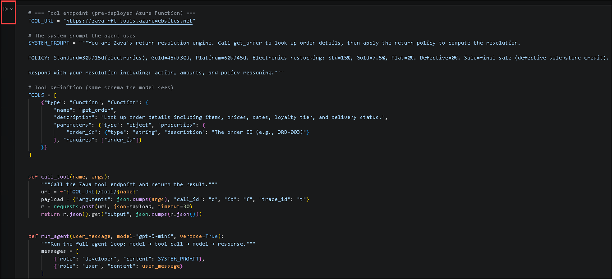

   **What this code does:**

   This code performs the following operations:

   - Defines the pre-deployed Azure Function endpoint.
   - Configures Zava’s return policy in the system prompt.
   - Defines the `get_order` tool schema.
   - Creates the function used to call the order lookup tool.
   - Creates the model and tool-calling agent loop.
   - Defines the Python grader used to score agent responses.
   - Assigns scoring weights for action, amount, policy reasoning, and tool usage.

   **Before you run this cell:**

   - Run Tasks 1 and 2 successfully.
   - Confirm that the Lab VM has internet access.
   - Confirm that the pre-deployed Azure Function is accessible.
   - Confirm that the `gpt-5-mini` model is available.

   **Expected result/output:**

   No output is expected. The cell is successful if it runs without errors.

## Task 4: Inspect the training example format

In this task, you will load and inspect the first record in the reinforcement fine-tuning training dataset.

1. Locate the fourth code cell in the notebook.

1. Run the following code:

    ```python
    # Let's look at the data format
    sample = json.loads(
        open("data/rft_v7_train.jsonl").readline()
    )
    print("Training example format:")
    print(json.dumps(sample, indent=2)[:600])
    ```

   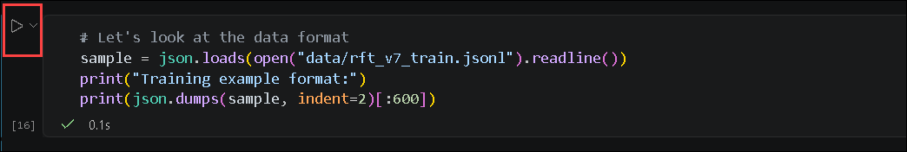

   **What this code does:**

   This code reads the first line from `data/rft_v7_train.jsonl`, converts the JSON record into a Python dictionary, and displays the first 600 characters in a formatted structure.

   **Before you run this cell:**

   - Run all previous cells successfully.
   - Confirm that `data/rft_v7_train.jsonl` exists.
   - Confirm that the notebook is running from the project’s expected working directory.

   **Expected result/output:**

   You should receive output similar to the following:

   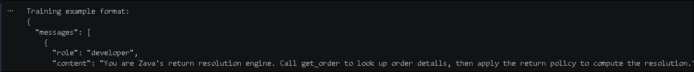

   > **Note:** The exact content depends on the first record in the training dataset.

## Task 5: Review the training and validation datasets

In this task, you will load both datasets, compare their sizes, and review sample user requests from the training data.

1. Locate the fifth code cell in the notebook.

1. Run the following code:

    ```python
    # Dataset overview
    with open("data/rft_v7_train.jsonl") as f:
        train_data = [json.loads(line) for line in f]

    with open("data/rft_v7_val.jsonl") as f:
        val_data = [json.loads(line) for line in f]

    print(f"Training examples: {len(train_data)}")
    print(f"Validation examples: {len(val_data)}")
    print(f"\nSample user messages from training set:")

    for i, ex in enumerate(train_data[:5]):
        user_msg = ex["messages"][-1]["content"]
        print(
            f"  [{i+1}] {user_msg[:80]}..."
            if len(user_msg) > 80
            else f"  [{i+1}] {user_msg}"
        )
    ```

   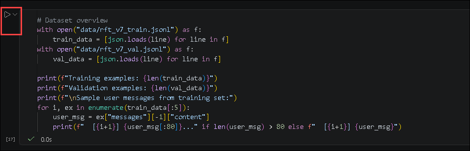

   **What this code does:**

   This code performs the following operations:

   - Loads all records from the training dataset.
   - Loads all records from the validation dataset.
   - Displays the number of records in each dataset.
   - Displays the first five user requests from the training dataset.

   **Before you run this cell:**

   - Run all previous cells successfully.
   - Confirm that both JSONL files are available in the `data` folder.
   - Confirm that each record contains a `messages` collection.

   **Expected result/output:**

   You should receive output similar to the following:

   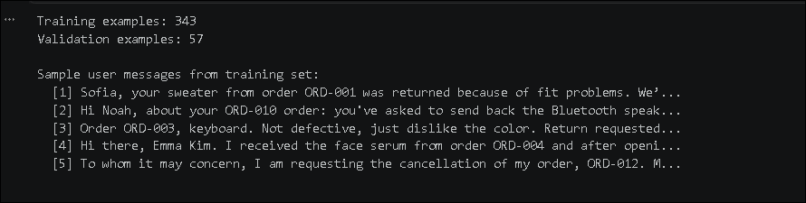

## Task 6: Inspect sample order data

In this task, you will call the `get_order` tool directly to inspect the order data available to the agent.

1. Locate the sixth code cell in the notebook.

1. Run the following code:

    ```python
    # Look up an order to understand the data
    order_data = call_tool(
        "get_order",
        {"order_id": "ORD-003"}
    )
    print("Order ORD-003 data:")
    print(json.dumps(json.loads(order_data), indent=2))
    ```

   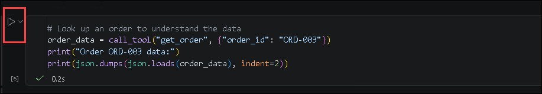

   **What this code does:**

   This code calls the pre-deployed Azure Function to retrieve the details for order `ORD-003`. It then parses and displays the returned order information as formatted JSON.

   **Before you run this cell:**

   - Run all previous cells successfully.
   - Confirm that the Azure Function endpoint is accessible.
   - Confirm that `call_tool` is defined.

   **Expected result/output:**

   You should receive the order information for `ORD-003`, including relevant fields such as the customer, item, price, loyalty tier, order date, and delivery status.

   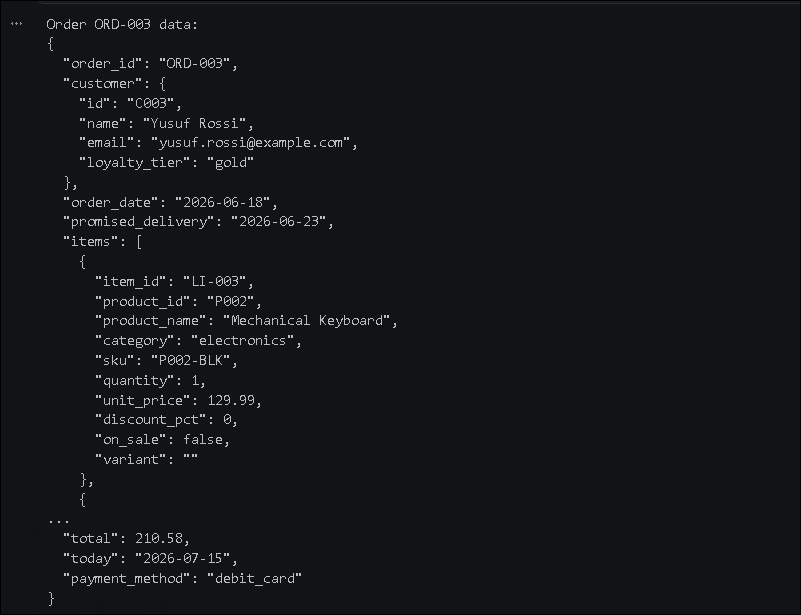

   > **Note:** Review the returned information carefully because the agent uses these details to calculate its resolution.

## Task 7: Test a custom training example

In this task, you will create a custom defective-product scenario, run it through the baseline agent, and evaluate the response with the Python grader.

1. Locate the seventh code cell in the notebook.

1. Run the following code:

    ```python
    my_example = {
        "messages": [
            {
                "role": "developer",
                "content": SYSTEM_PROMPT
            },
            {
                "role": "user",
                "content": "Yusuf Rossi here. The keyboard from ORD-003 stopped working after a week. Keys are unresponsive."
            }
        ],
        "expected_resolution": "Refund $89.99 for defective keyboard. Gold tier, within 45-day window. Defective items have $0 restocking fee."
    }

    # Test: what does base gpt-5-mini say for our example?
    output, tools = run_agent(
        my_example["messages"][-1]["content"],
        verbose=True
    )
    score = python_grader(
        output,
        tools,
        my_example["expected_resolution"]
    )
    print(f"\n🎯 Grader score: {score:.3f}")
    ```

   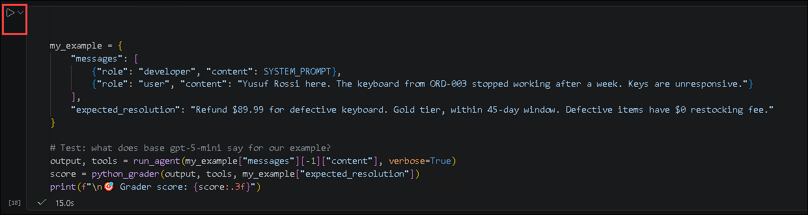

   **What this code does:**

   This code performs the following operations:

   - Creates a custom scenario involving a defective keyboard.
   - Defines the expected resolution for the request.
   - Runs the scenario through the baseline `gpt-5-mini` agent.
   - Retrieves the order details through the `get_order` tool.
   - Compares the response with the expected resolution.
   - Displays a grader score from `0.0` to `1.0`.

   **Before you run this cell:**

   - Run all previous cells successfully.
   - Confirm that `run_agent` and `python_grader` are defined.
   - Confirm that the model and tool endpoint are accessible.

   **Expected result/output:**

   The output should include:

   - A call to `get_order` for `ORD-003`.
   - A preview of the order data.
   - The agent’s return resolution.
   - A final grader score.

   You should receive output similar to the following:

   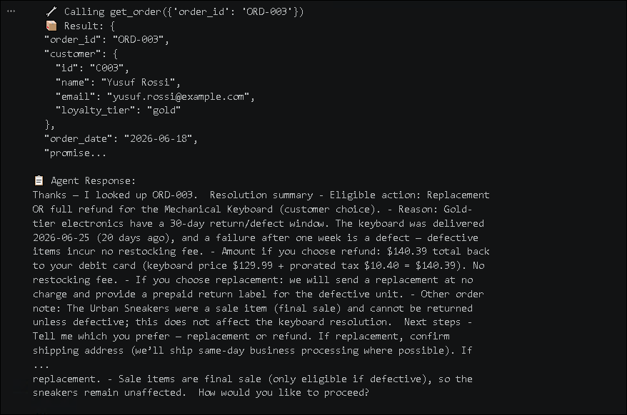

   > **Note:** The score might vary because model responses are nondeterministic. Confirm that the response identifies the item as defective, includes the expected refund amount, references the Gold-tier return window, and applies no restocking fee.

## Task 8: Upload the training and validation files

In this task, you will upload the training and validation datasets for use in the fine-tuning job.

1. Locate the eighth code cell in the notebook.

1. Run the following code:

    ```python
    # Step 2: Upload files
    print("Uploading training data...")

    with open("data/rft_v7_train.jsonl", "rb") as f:
        train_file = client.files.create(
            file=f,
            purpose="fine-tune"
        )
    print(
        f"  Train: {train_file.id} "
        f"({train_file.bytes:,} bytes)"
    )

    with open("data/rft_v7_val.jsonl", "rb") as f:
        val_file = client.files.create(
            file=f,
            purpose="fine-tune"
        )
    print(
        f"  Val: {val_file.id} "
        f"({val_file.bytes:,} bytes)"
    )

    # Wait for processing
    import time

    for _ in range(12):
        t = client.files.retrieve(train_file.id)
        v = client.files.retrieve(val_file.id)

        if (
            t.status == "processed"
            and v.status == "processed"
        ):
            print("  ✅ Files ready!")
            break

        time.sleep(10)
    ```

   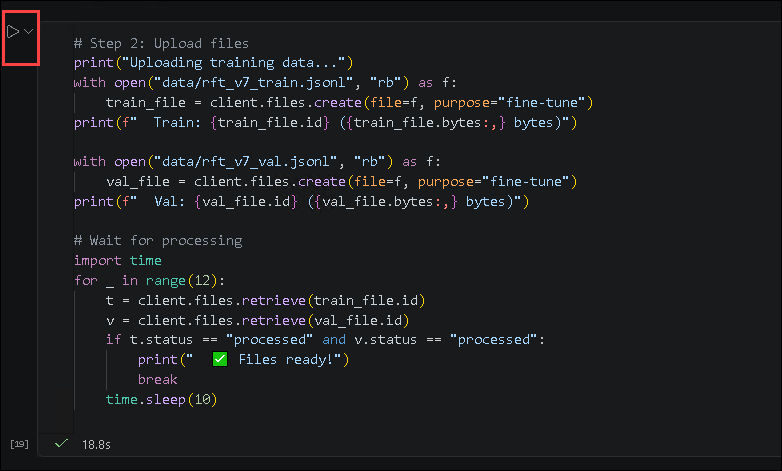

   **What this code does:**

   This code performs the following operations:

   - Uploads the training dataset for fine-tuning.
   - Uploads the validation dataset for fine-tuning.
   - Displays each uploaded file’s ID and size.
   - Checks the processing status of both files.
   - Waits up to approximately two minutes for both files to reach the `processed` state.

   **Before you run this cell:**

   - Run all previous cells successfully.
   - Confirm that both JSONL files are valid and accessible.
   - Confirm that the direct Azure OpenAI client is configured correctly.
   - Confirm that your Azure OpenAI resource supports file uploads and fine-tuning.

   **Expected result/output:**

   You should receive output similar to the following:

   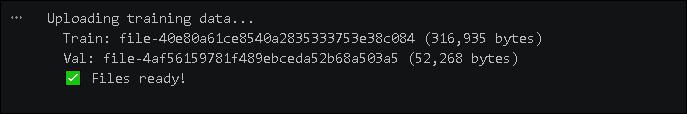

   > **Note:** Record the training and validation file IDs. They are stored in `train_file.id` and `val_file.id` and are used when the fine-tuning job is submitted.

   > **Note:** If the files do not reach the `processed` state during the polling period, retrieve their status again before submitting the job.

## Task 9: Define the reinforcement grader

In this task, you will define the grader source that will be embedded in the reinforcement fine-tuning job.

1. Locate the ninth code cell in the notebook.

1. Run the following code:

    ```python
    # Step 3: Define the grader (same Python function, embedded as a string)
    GRADER_SOURCE = r"""
    import json
    import re

    def grade(sample, item):
        output_text = sample.get("output_text", "") or ""
        output_tools = sample.get("output_tools", []) or []
        expected = item.get("expected_resolution", "")

        if not expected:
            return 0.5

        score = 0.0
        exp_lower = expected.lower()
        out_lower = output_text.lower()

        # Action (0.4)
        actions = {
            "refund": ["refund"],
            "denied": [
                "denied", "deny", "not eligible", "cannot", "expired"
            ],
            "store credit": ["store credit", "store_credit"],
            "replacement": ["replacement", "replace"],
            "exchange": ["exchange", "swap"],
            "cancel": ["cancel", "cancellation"]
        }
        for action, keywords in actions.items():
            if any(k in exp_lower for k in keywords):
                if any(k in out_lower for k in keywords):
                    score += 0.4
                break

        # Amount (0.3)
        exp_amounts = re.findall(r'\$(\d+\.\d{2})', expected)
        if exp_amounts:
            out_amounts = re.findall(
                r'\$(\d+\.\d{2})',
                output_text
            )
            hits = sum(
                1 for a in exp_amounts
                if a in out_amounts
            )
            score += 0.3 * (hits / len(exp_amounts))
        else:
            score += 0.15

        # Policy terms (0.2)
        policy_terms = [
            "window", "restocking", "defective", "sale",
            "platinum", "gold", "standard", "late",
            "shipping credit", "personal care", "eligible"
        ]
        exp_terms = [
            t for t in policy_terms
            if t in exp_lower
        ]
        if exp_terms:
            hits = sum(
                1 for t in exp_terms
                if t in out_lower
            )
            score += 0.2 * (hits / len(exp_terms))

        # Tool usage (0.1)
        if output_tools:
            tool_names = [
                t.get("function", {}).get("name", "")
                for t in output_tools
            ]
            if "get_order" in tool_names:
                score += 0.1

        return round(min(score, 1.0), 3)
    """
    ```

   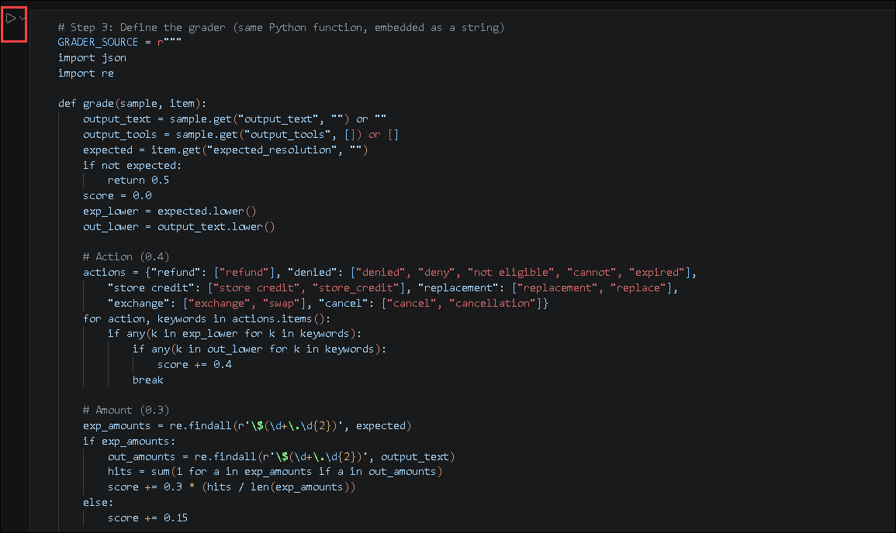

   **What this code does:**

   This code stores the grader implementation as a Python source string. The fine-tuning service will execute this grader during reinforcement training.

   The grader assigns the following weights:

   | Evaluation criterion | Weight |
   |---|---:|
   | Correct resolution action | 0.4 |
   | Correct monetary amount | 0.3 |
   | Relevant policy reasoning | 0.2 |
   | Correct use of `get_order` | 0.1 |

   **Before you run this cell:**

   - Run all previous cells successfully.
   - Confirm that the locally tested grader behaves as expected.
   - Do not remove the `grade(sample, item)` function from the source string.

   **Expected result/output:**

   No output is expected. The cell is successful if it runs without errors and defines `GRADER_SOURCE`.

   > **Note:** The `.strip()` operation used during job submission removes unnecessary leading and trailing whitespace from the grader source.

## Task 10: Submit the reinforcement fine-tuning job

In this task, you will configure the remote tool, grader, training parameters, and model before submitting the reinforcement fine-tuning job.

1. Locate the tenth code cell in the notebook.

1. Review the following configuration before running the cell:

   | Setting | Value |
   |---|---|
   | Base model | `gpt-5` |
   | Job suffix | `zava-lab` |
   | Fine-tuning method | Reinforcement |
   | Passing threshold | `0.80` |
   | Maximum episode steps | `5` |
   | Number of epochs | `3` |
   | Learning-rate multiplier | `1.0` |
   | Compute multiplier | `1.5` |
   | Reasoning effort | `medium` |
   | Evaluation interval | `5` |
   | Evaluation samples | `10` |
   | Training type | `globalStandard` |

1. Run the following code:

    ```python
    # Step 4: Submit the job!
    TOOL_CONFIG = [
        {
            "name": "get_order",
            "server_url": f"{TOOL_URL}/tool/get_order",
            "headers": {}
        }
    ]

    job = client.fine_tuning.jobs.create(
        model="o4-mini",
        training_file=train_file.id,
        validation_file=val_file.id,
        suffix="zava-lab",
        method={
            "type": "reinforcement",
            "reinforcement": {
                "grader": {
                    "type": "python",
                    "name": "zava_grader",
                    "source": GRADER_SOURCE.strip(),
                    "pass_threshold": 0.80,
                },
                "tools": TOOL_CONFIG,
                "max_episode_steps": 5,
                "hyperparameters": {
                    "n_epochs": 3,
                    "learning_rate_multiplier": 1.0,
                    "compute_multiplier": 1.5,
                    "reasoning_effort": "medium",
                    "eval_interval": 5,
                    "eval_samples": 10,
                },
            }
        },
        extra_body={
            "trainingType": "globalStandard"
        }
    )

    print(f"🚀 Job submitted!")
    print(f"   ID: {job.id}")
    print(f"   Status: {job.status}")
    print(f"   Model: {job.model}")
    print(
        f"\n⏳ Training can take 10 hours. "
        f"We'll explore pre-run results next."
    )
    ```

   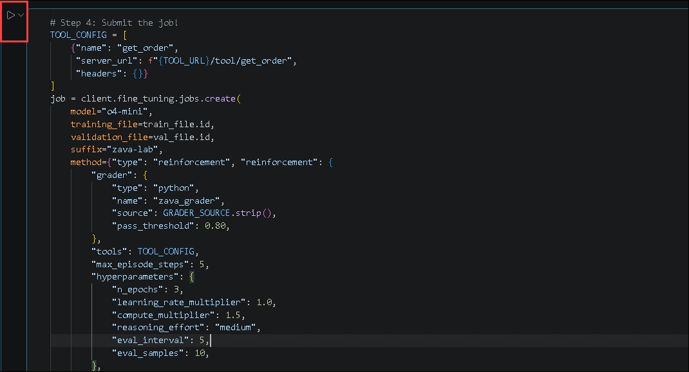

   **What this code does:**

   This code performs the following operations:

   - Configures the remote `get_order` tool used during reinforcement training.
   - Selects the uploaded training and validation files.
   - Configures `gpt-5` as the base model.
   - Configures reinforcement fine-tuning as the training method.
   - Embeds the Python grader and sets a passing threshold of `0.80`.
   - Defines the maximum number of agent steps per training episode.
   - Configures the training and evaluation hyperparameters.
   - Submits the job to the fine-tuning service.
   - Displays the job ID, initial status, and base model.

   **Before you run this cell:**

   - Confirm that the training and validation files reached the `processed` state.
   - Confirm that `train_file.id` and `val_file.id` are available.
   - Confirm that `GRADER_SOURCE` and `TOOL_CONFIG` are configured correctly.
   - Confirm that the Azure OpenAI resource supports reinforcement fine-tuning for `gpt-5`.
   - Be aware that submitting the job starts a potentially billable training operation.

   **Expected result/output:**

   You should receive output similar to the following:

   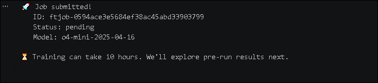

   > **Note:** Save the fine-tuning job ID. You will use it to monitor the job and retrieve its results in a later exercise.

   > **Note:** The initial status might appear as `pending`, `queued`, or another nonterminal status. The job does not need to finish before you continue to an exercise that uses pre-generated results.

   > **Note:** If the API rejects the request, review the returned validation error. Common causes include unsupported model or region combinations, unprocessed files, invalid grader source, unavailable fine-tuning capacity, or incorrect endpoint configuration.

## Summary

In this exercise, you have completed the following:

- Opened the `04-build-data-submit-job.ipynb` notebook.
- Connected to the Microsoft Foundry project.
- Configured a direct Azure OpenAI client.
- Defined Zava’s return resolution agent and order lookup tool.
- Configured and tested the Python grader.
- Inspected the reinforcement training data format.
- Reviewed the training and validation datasets.
- Retrieved and inspected sample order data.
- Tested a custom defective-product scenario.
- Uploaded the training and validation datasets.
- Embedded the grader as Python source code.
- Configured the reinforcement fine-tuning hyperparameters.
- Submitted the reinforcement fine-tuning job.
- Captured the job ID and initial status for later monitoring.

### You have successfully completed this exercise.
