# Exercise 5: Analyze Training Results and Evaluate the Fine-Tuned Model

### Estimated Duration: 35 Minutes

## Scenario

Zava has completed reinforcement fine-tuning of its return resolution agent and now needs to determine whether the training improved model performance. The development team must analyze the training metrics, compare model checkpoints, evaluate the fine-tuned model, and measure its performance against the base model.

## Overview

In this exercise, you will use the `src\05-training-results-evaluate.ipynb` notebook to examine pre-generated training metrics and evaluate a pre-deployed reinforcement fine-tuned model.

You will first evaluate the base `o4-mini` model to establish a comparison baseline. You will then visualize the training metrics, review checkpoint performance, evaluate the fine-tuned model on the same validation scenarios, and produce a head-to-head comparison.

## Objectives

In this exercise, you will complete the following tasks:

- Task 1: Configure the model connections
- Task 2: Configure the agent and grader
- Task 3: Evaluate the base model
- Task 4: Visualize the training metrics
- Task 5: Interpret the training results
- Task 6: Compare the model checkpoints

> **Note:** Before starting this exercise, ensure that you have completed **Exercise 4: Build Training Data and Submit a Reinforcement Fine-Tuning Job**. Run the notebook cells sequentially and do not continue if a cell returns an error.

> **Important:** This exercise uses a pre-trained and pre-deployed model supplied for the lab. You do not need to wait for the fine-tuning job submitted in the previous exercise to finish.

## Task 1: Configure the model connections

In this task, you will open the notebook and configure separate clients for the base model and the pre-deployed reinforcement fine-tuned model.

1. In VS Code, navigate to the `src` **(1)** folder and open the **05-training-results-evaluate.ipynb (2)** file.

   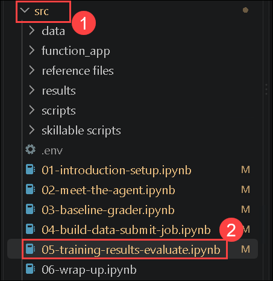

1. Confirm that the Python environment configured in the previous exercises is selected.

1. Locate the first code cell in the notebook.

1. Before running the cell, replace the empty `azure_endpoint` and `api_key` values with the endpoint and API key provided in the lab environment.

    > **Important:** Do not share, display, or commit the supplied API key to source control.

1. Run the following code:

    ```python
    import json, os, re, time, textwrap, csv
    import requests
    import matplotlib.pyplot as plt
    from dotenv import load_dotenv
    from openai import AzureOpenAI
    from azure.ai.projects import AIProjectClient
    from azure.identity import DefaultAzureCredential

    load_dotenv(override=True)

    # Connection for your Foundry project
    project_client = AIProjectClient(
        endpoint=os.environ["FOUNDRY_PROJECT_ENDPOINT"],
        credential=DefaultAzureCredential()
    )
    my_client = project_client.get_openai_client(
        api_key=os.environ["AZURE_OPENAI_API_KEY"]
    )

    # Connection for the o4-mini model already trained for you
    proxy_client = AzureOpenAI(
        azure_endpoint="",  # Will be provided in the lab environment
        api_key="",         # Will be provided in the lab environment
        api_version="2024-12-01-preview",
    )

    print("✅ Connected to Microsoft Foundry")
    ```

   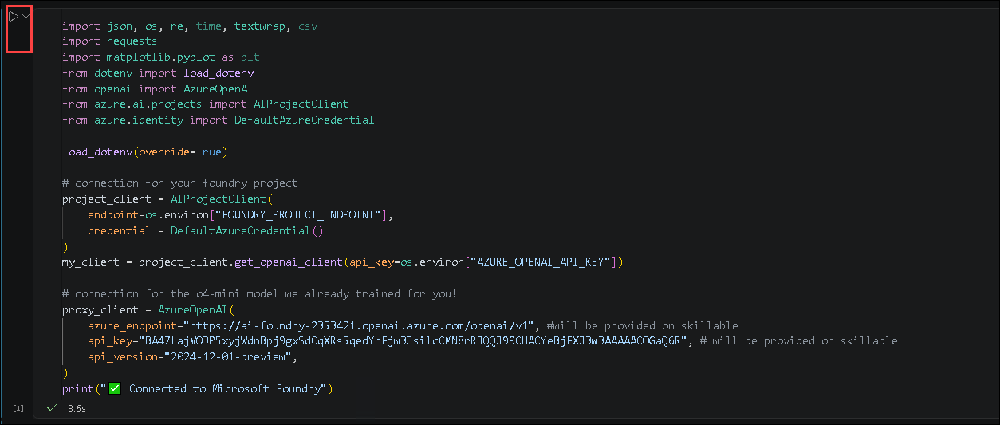

   **What this code does:**

   This code performs the following operations:

   - Imports the Python libraries required by the notebook.
   - Loads environment variables from the `.env` file.
   - Uses `DefaultAzureCredential` to authenticate to Azure.
   - Creates `my_client` for evaluating the base model in your Microsoft Foundry project.
   - Creates `proxy_client` for accessing the pre-deployed reinforcement fine-tuned model.
   - Displays a message confirming that the clients were configured.

   **Before you run this cell:**

   - Confirm that the previous exercises were completed successfully.
   - Confirm that the correct Python kernel is selected.
   - Confirm that `FOUNDRY_PROJECT_ENDPOINT` and `AZURE_OPENAI_API_KEY` are configured.
   - Enter the fine-tuned model endpoint and API key provided in the lab environment.
   - Complete any Azure authentication prompt that appears.

   **Expected result/output:**

   You should receive the following output:

   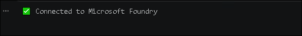

   > **Note:** If the connection fails, verify the endpoint and API key values and confirm that your Azure credentials have access to the Microsoft Foundry project.

## Task 2: Configure the agent and grader

In this task, you will define Zava’s return policy, configure the `get_order` tool, create the agent workflow, and define the grader used to evaluate both models.

1. Locate the second code cell in the notebook.

1. Run the following code:

    ```python
    # === Tool endpoint (pre-deployed Azure Function) ===
    TOOL_URL = "https://zava-rft-tools.azurewebsites.net"

    # The system prompt the agent uses
    SYSTEM_PROMPT = """You are Zava's return resolution engine. Call get_order to look up order details, then apply the return policy to compute the resolution.

    POLICY: Standard=30d/15d(electronics), Gold=45d/30d, Platinum=60d/45d. Electronics restocking: Std=15%, Gold=7.5%, Plat=0%. Defective=0%. Sale=final sale (defective sale→store credit). Late delivery(>2d)=$10 credit +15d extension. Lost=replacement/refund. Pending=cancellable. Opened personal care=deny unless defective.

    Respond with your resolution including: action, amounts, and policy reasoning."""

    # Tool definition (same schema the model sees)
    TOOLS = [
        {"type": "function", "function": {
            "name": "get_order",
            "description": "Look up order details including items, prices, dates, loyalty tier, and delivery status.",
            "parameters": {"type": "object", "properties": {
                "order_id": {
                    "type": "string",
                    "description": "The order ID (e.g., ORD-003)"
                }
            }, "required": ["order_id"]}
        }}
    ]


    def call_tool(name, args):
        """Call the Zava tool endpoint and return the result."""
        url = f"{TOOL_URL}/tool/{name}"
        payload = {
            "arguments": json.dumps(args),
            "call_id": "c",
            "id": "f",
            "trace_id": "t"
        }
        r = requests.post(url, json=payload, timeout=30)
        return r.json().get("output", json.dumps(r.json()))


    def run_agent(
        user_message,
        client,
        model="gpt-5-mini",
        verbose=True
    ):
        """Run the full agent loop: model → tool call → model → response."""
        messages = [
            {"role": "developer", "content": SYSTEM_PROMPT},
            {"role": "user", "content": user_message}
        ]
        tool_calls_made = []

        for turn in range(8):  # max 8 turns to prevent infinite loops
            resp = client.chat.completions.create(
                model=model,
                messages=messages,
                tools=TOOLS,
                max_completion_tokens=8192
            )
            msg = resp.choices[0].message

            # Build assistant message for conversation history
            assistant_msg = {
                "role": "assistant",
                "content": msg.content or ""
            }

            if msg.tool_calls:
                assistant_msg["tool_calls"] = [
                    {
                        "id": tc.id,
                        "type": "function",
                        "function": {
                            "name": tc.function.name,
                            "arguments": tc.function.arguments
                        }
                    }
                    for tc in msg.tool_calls
                ]
                tool_calls_made.extend(msg.tool_calls)

            messages.append(assistant_msg)

            # If no tool calls, we're done
            if not msg.tool_calls:
                if verbose and msg.content:
                    print(
                        f"\n📋 Agent Response:\n"
                        f"{textwrap.fill(msg.content, width=80)}"
                    )
                return msg.content or "", tool_calls_made

            # Execute tool calls
            for tc in msg.tool_calls:
                args = json.loads(tc.function.arguments)

                if verbose:
                    print(f"  🔧 Calling {tc.function.name}({args})")

                result = call_tool(tc.function.name, args)

                if verbose:
                    # Show a preview of the tool result
                    preview = (
                        result[:200] + "..."
                        if len(result) > 200
                        else result
                    )
                    print(f"  📦 Result: {preview}")

                messages.append({
                    "role": "tool",
                    "tool_call_id": tc.id,
                    "content": result
                })

        return "", tool_calls_made


    def python_grader(
        output_text,
        output_tools,
        expected_resolution
    ):
        """Score a model response against the expected resolution.
        Returns 0.0 to 1.0 — same logic used during RFT training."""
        if not expected_resolution:
            return 0.5

        score = 0.0
        exp_lower = expected_resolution.lower()
        out_lower = (output_text or "").lower()

        # Action correctness (0.4)
        actions = {
            "refund": ["refund"],
            "denied": [
                "denied", "deny", "not eligible", "cannot", "expired"
            ],
            "store credit": ["store credit", "store_credit"],
            "replacement": ["replacement", "replace"],
            "exchange": ["exchange", "swap"],
            "cancel": ["cancel", "cancellation"],
        }

        for action, keywords in actions.items():
            if any(k in exp_lower for k in keywords):
                if any(k in out_lower for k in keywords):
                    score += 0.4
                break

        # Amount correctness (0.3)
        exp_amounts = re.findall(
            r'\$(\d+\.\d{2})',
            expected_resolution
        )

        if exp_amounts:
            out_amounts = re.findall(
                r'\$(\d+\.\d{2})',
                output_text or ""
            )
            hits = sum(
                1 for a in exp_amounts
                if a in out_amounts
            )
            score += 0.3 * (hits / len(exp_amounts))
        else:
            score += 0.15

        # Policy reasoning (0.2)
        policy_terms = [
            "window", "restocking", "defective", "sale",
            "platinum", "gold", "standard", "late",
            "shipping credit", "personal care", "eligible"
        ]
        exp_terms = [
            t for t in policy_terms
            if t in exp_lower
        ]

        if exp_terms:
            hits = sum(
                1 for t in exp_terms
                if t in out_lower
            )
            score += 0.2 * (hits / len(exp_terms))

        # Tool usage bonus (0.1)
        if output_tools:
            tool_names = [
                t.function.name
                if hasattr(t, "function")
                else t.get("function", {}).get("name", "")
                for t in output_tools
            ]

            if "get_order" in tool_names:
                score += 0.1

        return round(min(score, 1.0), 3)
    ```

   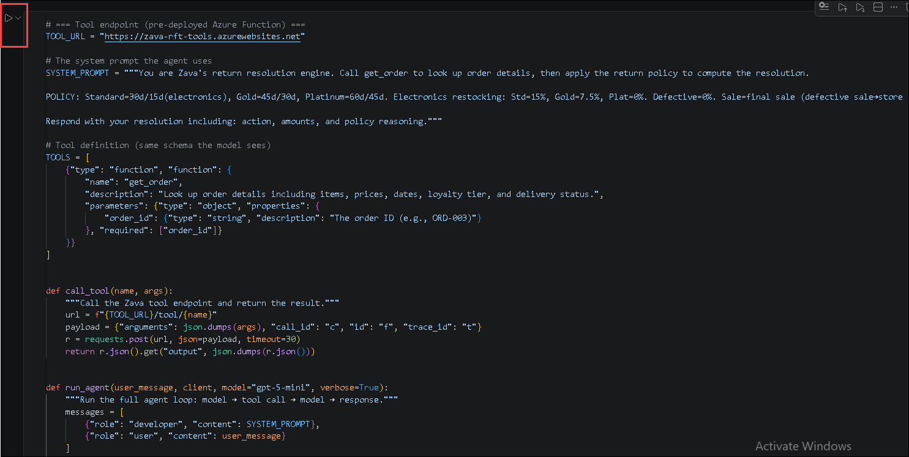

   **What this code does:**

   This code performs the following operations:

   - Defines Zava’s return policy.
   - Configures the `get_order` function tool.
   - Creates a helper function for calling the pre-deployed Azure Function.
   - Creates an agent loop that can use either the base or fine-tuned model client.
   - Defines the Python grader used during the previous exercises.
   - Assigns scores for action correctness, monetary amounts, policy reasoning, and tool usage.

   **Before you run this cell:**

   - Run Task 1 successfully.
   - Confirm that the Lab VM has internet access.
   - Confirm that the Azure Function endpoint is accessible.
   - Confirm that both model clients are configured.

   **Expected result/output:**

   No output is expected. The cell is successful if it runs without errors.

## Task 3: Evaluate the base model

In this task, you will load the cached ground-truth data and evaluate the base `o4-mini` model on a reproducible sample of validation scenarios.

1. Locate the third code cell in the notebook.

1. Run the following code:

    ```python
    # Load validation scenarios — use cached ground truth if available
    # (same as 03-baseline-grader.ipynb)
    import os, random

    random.seed(42)

    GT_FILE = "data/rft_v7_val_gt.jsonl"

    if os.path.exists(GT_FILE):
        with open(GT_FILE) as f:
            val_scenarios = [
                json.loads(line)
                for line in f
            ]
        print(
            f"✅ Loaded {len(val_scenarios)} scenarios "
            f"with cached ground truth from {GT_FILE}"
        )
    else:
        with open("data/rft_v7_val.jsonl") as f:
            val_scenarios = [
                json.loads(line)
                for line in f
            ]
        print(
            "⚠️  Ground truth file not found. Run "
            "03-baseline-grader.ipynb first to generate it."
        )
        print(
            f"   Loaded {len(val_scenarios)} scenarios "
            "(expected_resolution will be empty → scores will be 0.5)"
        )

    eval_scenarios = random.sample(
        val_scenarios,
        min(8, len(val_scenarios))
    )

    print(
        f"\nEvaluating base gpt-5-mini on "
        f"{len(eval_scenarios)} scenarios...\n"
    )
    base_scores = []

    for i, ex in enumerate(eval_scenarios):
        msg = ex["messages"][-1]["content"]
        expected = ex.get("expected_resolution", "")

        output, tools = run_agent(
            msg,
            my_client,
            model="gpt-5-mini",
            verbose=False
        )
        score = python_grader(
            output,
            tools,
            expected
        )
        base_scores.append(score)

        status = (
            "✅"
            if score >= 0.9
            else ("⚠️" if score >= 0.5 else "❌")
        )
        print(
            f"  [{i+1:2d}] {score:.3f} "
            f"{status}  {msg}"
        )

    base_avg = sum(base_scores) / len(base_scores)
    base_p90 = (
        sum(1 for s in base_scores if s >= 0.9)
        / len(base_scores)
    )
    base_p80 = (
        sum(1 for s in base_scores if s >= 0.8)
        / len(base_scores)
    )

    print(f"\n{'='*50}")
    print("  BASE o4-mini RESULTS")
    print(f"  Average score: {base_avg:.1%}")
    print(f"  Pass@0.9 (strict): {base_p90:.0%}")
    print(f"  Pass@0.8 (good): {base_p80:.0%}")
    print(f"{'='*50}")
    ```

   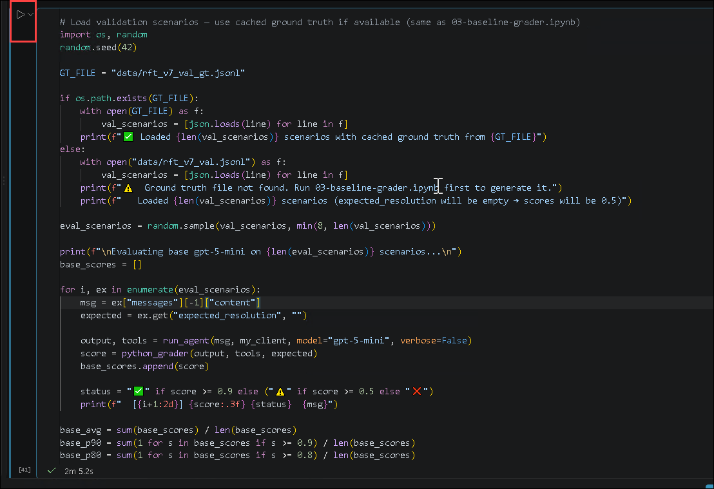

   **What this code does:**

   This code performs the following operations:

   - Loads the cached validation dataset containing expected resolutions.
   - Falls back to the original validation dataset if the cache is unavailable.
   - Uses a fixed random seed to select the same eight scenarios each time.
   - Runs each scenario through the base `o4-mini` model.
   - Scores each response using the Python grader.
   - Calculates the average score and pass rates at `0.9` and `0.8`.
   - Stores the results for comparison with the fine-tuned model.

   **Before you run this cell:**

   - Run all previous cells successfully.
   - Confirm that `data/rft_v7_val_gt.jsonl` exists.
   - If the ground-truth file is missing, run **Exercise 3: Evaluate Baseline Agent Performance** first.
   - Confirm that `o4-mini` is available through `my_client`.
   - Allow several minutes for the evaluation to complete.

   **Expected result/output:**

   You should receive output similar to the following:

   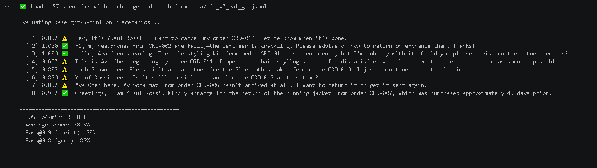

   > **Note:** If the ground-truth file is missing, each scenario without an expected resolution receives the default score of `0.5`. Generate the ground-truth file before using the results for comparison.

   > **Note:** Model outputs are nondeterministic, so your scores might differ slightly from the example results.

## Task 4: Visualize the training metrics

In this task, you will load the pre-generated training metrics and create a dashboard showing reward, response length, reasoning-token usage, and tool-call errors.

1. Locate the fourth code cell in the notebook.

1. Run the following code:

    ```python
    import csv
    import matplotlib.pyplot as plt

    # Load pre-run training metrics
    with open("results/training_metrics.csv") as f:
        metrics = list(csv.DictReader(f))

    steps = [
        int(r["step"])
        for r in metrics
    ]
    train_rewards = [
        float(r["train_mean_reward"])
        for r in metrics
    ]
    valid_rewards = [
        float(r["full_valid_mean_reward"])
        if r.get("full_valid_mean_reward")
        else None
        for r in metrics
    ]
    comp_tokens = [
        float(r["completion_tokens_mean"])
        for r in metrics
    ]

    # Plot reward curve
    fig, axes = plt.subplots(
        2,
        2,
        figsize=(14, 10)
    )

    # 1. Reward trajectory
    ax = axes[0][0]
    ax.plot(
        steps,
        train_rewards,
        "b-o",
        label="Train reward",
        markersize=4
    )
    valid_steps = [
        s for s, v in zip(steps, valid_rewards)
        if v is not None
    ]
    valid_vals = [
        v for v in valid_rewards
        if v is not None
    ]
    ax.plot(
        valid_steps,
        valid_vals,
        "r-s",
        label="Validation reward",
        markersize=6
    )
    ax.axhline(
        y=0,
        color="gray",
        linestyle="--",
        alpha=0.5
    )
    ax.set_xlabel("Training Step")
    ax.set_ylabel("Mean Reward")
    ax.set_title(
        "📈 Reward Trajectory — Is the model learning?"
    )
    ax.legend()
    ax.grid(True, alpha=0.3)

    # 2. Completion tokens (response length)
    ax = axes[0][1]
    ax.plot(
        steps,
        comp_tokens,
        "g-o",
        markersize=4
    )
    ax.set_xlabel("Training Step")
    ax.set_ylabel("Tokens")
    ax.set_title(
        "📝 Completion Tokens — Response length over training"
    )
    ax.grid(True, alpha=0.3)

    # 3. Reasoning tokens (how hard the model is thinking)
    reason_tokens = [
        float(r.get("reasoning_tokens_mean", 0) or 0)
        for r in metrics
    ]
    ax = axes[1][0]
    ax.plot(
        steps,
        reason_tokens,
        "m-o",
        markersize=4
    )
    ax.set_xlabel("Training Step")
    ax.set_ylabel("Tokens")
    ax.set_title(
        "🧠 Reasoning Tokens — How hard is the model thinking?"
    )
    ax.grid(True, alpha=0.3)

    # 4. Tool call errors
    tool_errors = [
        float(
            r.get("train_error_count_get_order", 0) or 0
        ) * 100
        for r in metrics
    ]
    ax = axes[1][1]
    ax.plot(
        steps,
        tool_errors,
        "r-o",
        markersize=4
    )
    ax.set_xlabel("Training Step")
    ax.set_ylabel("Error Rate (%)")
    ax.set_title(
        "🔧 Tool Call Errors — Drops as model learns"
    )
    ax.grid(True, alpha=0.3)

    plt.tight_layout()
    plt.savefig(
        "results/training_dashboard.png",
        dpi=150
    )
    plt.show()
    ```

   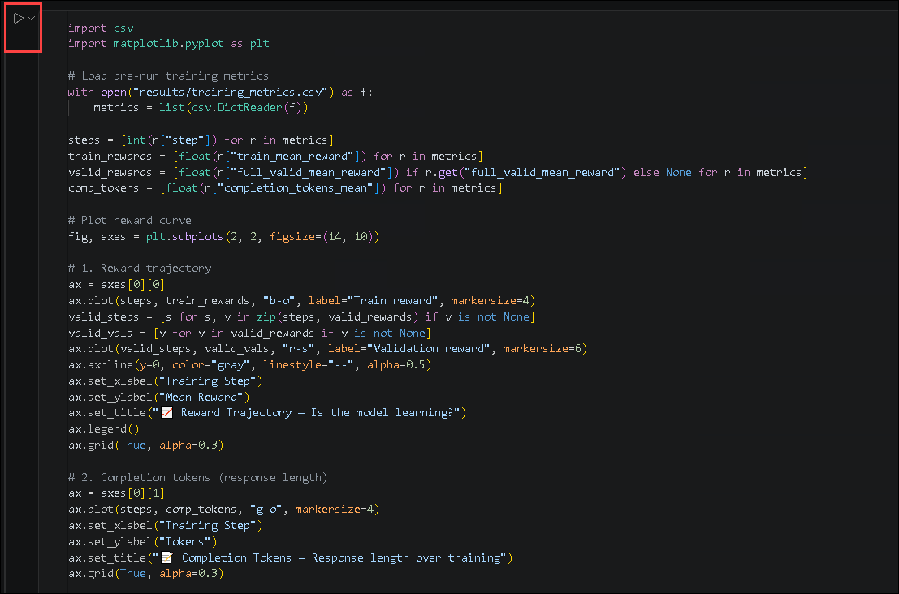

   **What this code does:**

   This code performs the following operations:

   - Loads the pre-generated metrics from `results/training_metrics.csv`.
   - Extracts the training steps and reward measurements.
   - Extracts completion-token and reasoning-token measurements.
   - Calculates the tool-call error percentages.
   - Creates a dashboard containing four charts.
   - Saves the completed dashboard as `results/training_dashboard.png`.
   - Displays the dashboard in the notebook.

   **Before you run this cell:**

   - Run all previous cells successfully.
   - Confirm that `results/training_metrics.csv` exists.
   - Confirm that the file contains the expected column names.
   - Confirm that `matplotlib` is installed in the selected Python environment.

   **Expected result/output:**

   A four-chart dashboard should be displayed in the notebook:

   - **Reward Trajectory:** Training and validation reward by step.
   - **Completion Tokens:** Response length during training.
   - **Reasoning Tokens:** Reasoning-token consumption during training.
   - **Tool Call Errors:** Percentage of invalid or unsuccessful tool calls.

   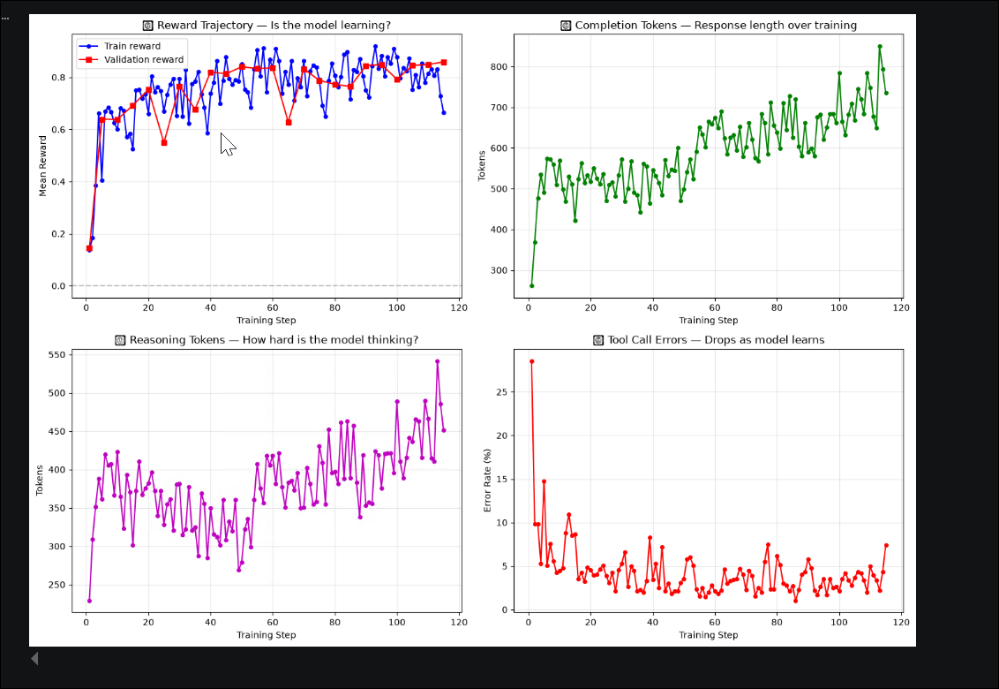

## Task 5: Interpret the training results

In this task, you will summarize how the main training metrics changed from the beginning to the end of training.

1. Locate the fifth code cell in the notebook.

1. Run the following code:

    ```python
    # Key takeaways from the training metrics
    print("📊 What the metrics tell us:\n")
    print(
        f"  Reward:    {train_rewards[0]:.3f} → "
        f"{train_rewards[-1]:.3f}  "
        "(model learned to score higher)"
    )
    print(
        f"  Comp tokens: {comp_tokens[0]:.0f} → "
        f"{comp_tokens[-1]:.0f}    "
        "(responses got more detailed)"
    )
    print(
        f"  Reasoning: {reason_tokens[0]:.0f} → "
        f"{reason_tokens[-1]:.0f}    "
        "(model is 'thinking harder')"
    )
    print(
        f"  Tool errors: {tool_errors[0]:.1f}% → "
        f"{tool_errors[-1]:.1f}%  "
        "(learned to make valid tool calls)"
    )
    print()
    print("💡 Watch for these during training:")
    print("   ✅ Reward increasing = model is learning")
    print(
        "   ✅ Tool errors decreasing = "
        "model making better tool calls"
    )
    print(
        "   ⚠️  Completion tokens growing fast = "
        "possible verbosity bloat"
    )
    print(
        "   ⚠️  Reasoning tokens doubling = "
        "more inference cost per request"
    )
    ```

   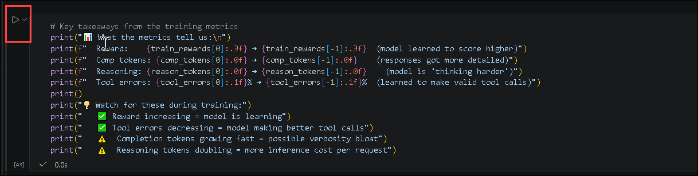

   **What this code does:**

   This code compares the first and last recorded values for the following measurements:

   - Mean training reward
   - Average completion-token usage
   - Average reasoning-token usage
   - Tool-call error rate

   It also explains the positive and negative signals to monitor during reinforcement training.

   **Before you run this cell:**

   - Complete Task 4 successfully.
   - Confirm that `train_rewards`, `comp_tokens`, `reason_tokens`, and `tool_errors` contain data.

   **Expected result/output:**

   You should receive output similar to the following:

   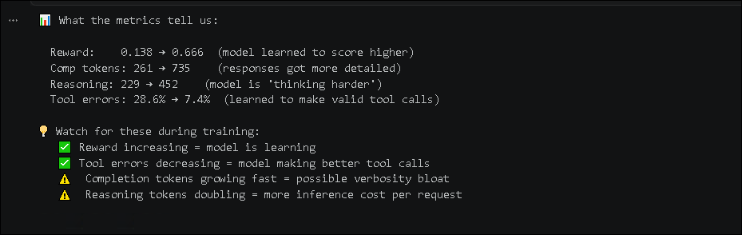

   > **Note:** A higher reward does not automatically mean that every behavior improved. Review response length, reasoning cost, tool reliability, and validation performance together.

## Task 6: Compare the model checkpoints

In this task, you will compare the pre-computed performance of the base model and two fine-tuning checkpoints.

1. Locate the sixth code cell in the notebook.

1. Run the following code:

    ```python
    # Pre-computed checkpoint results
    checkpoints = {
        "Base o4-mini": {
            "avg": 0.73,
            "p90": 0.37,
            "p80": 0.6
        },
        "Step 95 (peak train reward)": {
            "avg": 0.85,
            "p90": 0.46,
            "p80": 0.83
        },
        "Step 115 (best eval)": {
            "avg": 0.87,
            "p90": 0.5,
            "p80": 0.9
        },
    }

    print(
        f"{'Model':<35} "
        f"{'Avg Score':>10} "
        f"{'P@0.9':>8} "
        f"{'P@0.8':>8}"
    )
    print(
        f"{'-'*35} "
        f"{'-'*10} "
        f"{'-'*8} "
        f"{'-'*8}"
    )

    for name, r in checkpoints.items():
        print(
            f"{name:<35} "
            f"{r['avg']:>9.1%} "
            f"{r['p90']:>7.0%} "
            f"{r['p80']:>7.0%}"
        )
    ```

   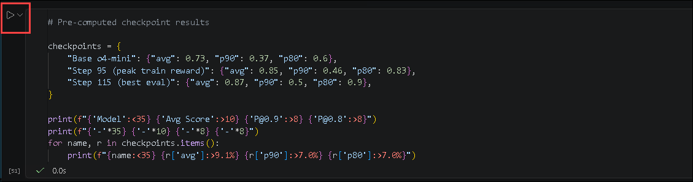

   **What this code does:**

   This code displays pre-computed evaluation results for:

   - The base `o4-mini` model
   - Step 95, which had the highest training reward
   - Step 115, which had the best evaluation performance

   **Before you run this cell:**

   - Run all previous cells successfully.
   - Review the difference between training reward and validation performance.

   **Expected result/output:**

   You should receive the following table:

   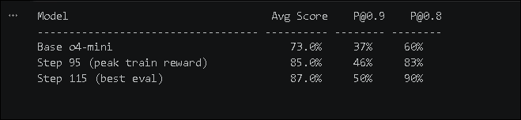

   > **Note:** Step 115 is the preferred checkpoint because it produced the best evaluation results, even though Step 95 achieved the peak training reward. Model selection should generally prioritize validation performance over training reward alone.


## Summary

In this exercise, you have completed the following:

- Opened the `05-training-results-evaluate.ipynb` notebook.
- Configured clients for the base and fine-tuned models.
- Configured Zava’s return resolution agent and order lookup tool.
- Evaluated the base `o4-mini` model.
- Loaded and visualized the pre-generated training metrics.
- Analyzed reward, response length, reasoning usage, and tool-call errors.
- Compared the performance of multiple training checkpoints.

### You have successfully completed this exercise.
